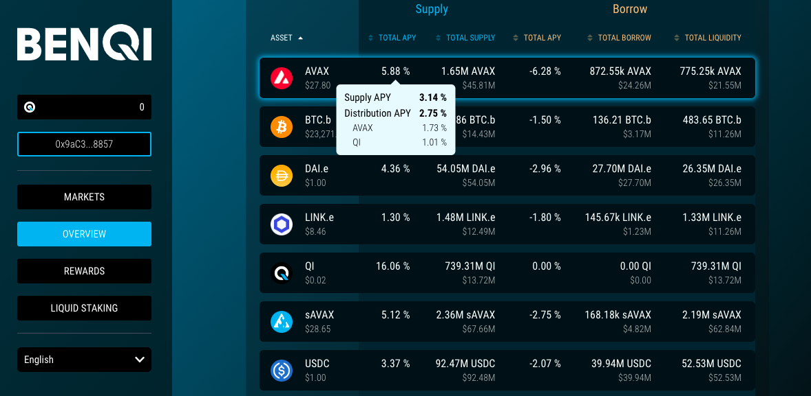
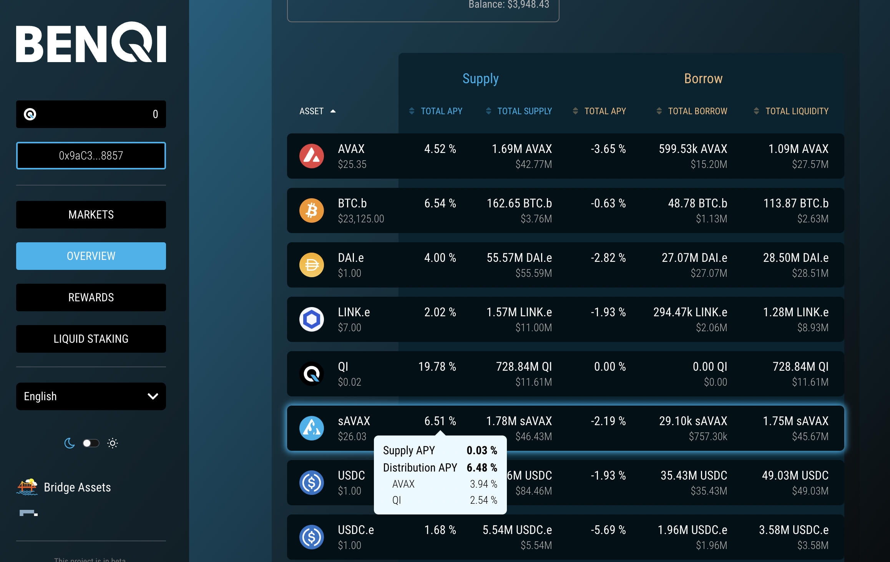

## Chapter 1: Hello, world!

So, when I said we aren't going to do "Hello, world!" Why are we here doing
"Hello, world!"?

Well, it's because I'm an onery son o' a gun. Get used to it.

Okay, (relenting), it's because the "Hello, world!"-app is, well: useless. We
need to say "Hello, Johny!" or "Hello, " ... whomever we're "hello"-ing to.

Why?

"Hello, world!" is output only, non-configurable. A useless program.

But "Hello, "... whomever is both input and output and configurable.

From "Hello, geophf!" you can go in just about any direction we want to go.

Neat-o.

But before we do that, let's do our first pop-quiz.

### Pop quiz: Benqi $QI yields

Pop quiz:

$QI SUPPLY on @BenqiFinance is currently paying 16.73% $AVAX yield (you read 
that correctly).

How much $QI, in USD, would you need to supply to @BenqiFinance in order to 
earn $10 in $AVAX yield per day?

answer

BONUS questions

1. How much do you make in 1 year? answer.
1. ... if you resupply the $QI yield at 3%. answer.
1. ... if you supply the $AVAX yield at 1.5% supply (automatic) growth. non-sequitur.
1. ... if you reinvest all yields ($QI and $AVAX) continuously ($AVAX yields at 2% and 1% $QI) answer.

BONUS-BONUS questions:

1. Is it better or worse if you convert the $AVAX yields to $sAVAX and supply that?
1. Measure by how much better or worse, show annual returns of all yielded tokens. 
answers

$sAVAX: (automatic) supply: 0.03%, $AVAX yield: 3.91%, $QI yield: 2.52
