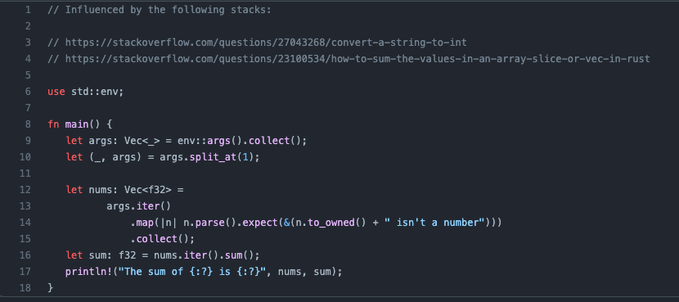

# Chapter 2: Summer in the City

Let's start off this chapter with a pop-quiz.

## Summer

It's Summer, ... well, in the Northern Hemisphere.

Write summer in Rust:

```BASH
$ ./summer
The sum of [] is 0.0.

$ ./summer 1 2 3.14159
The sum of [1.0, 2.0, 3.14159] is 6.14159.

$ ./summer 1 apple 2 bananas
halts with Rust error: "apple isn't a number"
```

([answer](src/ch02/summer.rs)) *(don't peek until you've tried to solve this 
on your own)*

Give that a go from what you know from chapter 1 and what you can scower from
the internetz.


## Part II: Discussion

Answer to the Rust quiz 2: summer



### Lines 1-10:

```Rust
// Influenced by the following stacks:

// https://stackoverflow.com/questions/27043268/convert-a-string-to-int
// https://stackoverflow.com/questions/23100534/how-to-sum-the-values-in-an-array-slice-or-vec-in-rust

use std::env;

fn main() {
   let args: Vec<_> = env::args().collect();
   let (_, args) = args.split_at(1);

```

Q: Aren't these lines the same as in the first chapter?  
A: Yes.

Q: So, can we put this code into a library, or something, instead of having to 
write for each new program?  
A: Exactly! Not for this program, but the next program will be about writing 
your own modules.

### Lines 12-15:

```Rust
let nums: Vec<f32> =
  args.iter()
  .map(|n| n.parse().expect(&(n.to_owned() + " isn't a number")))
  .collect();
```

Q: Line 12 we saw in ch 1, what does line 13 do?  
A: converts args into an iterable object, a stream; you see this also in 
line 16.

Q: `map` who-the-what?  
A: Let's work through this:

* `map` maps a function over a stream.
* `|n|` creates a function that takes an argument, `n`
* the function parses `n`, expecting it to be a number
* if `n` isn't, it throws an error with a message saying it isn't a number.

EASY!

Q: line 15 collects ... what?  
A: `collect` collects the result from a stream into the, well, collection-type 
you've declared (in this case, a `vec`(tor) of `f32` numbers).

Q: What's the '`f`' in `f32`?  
A: Eheh. No, it's a 'float'ing point number. Really: that's what the '`f`' 
stands for. ... honest. 😅

### Line 16:

```Rust
let sum: f32 = nums.iter().sum();
```

Q: `iter` puts the collection to a stream, `sum` sums the stream. No `collect`?  
A: You don't need to collect when you're getting a single value (or 'scalar,' 
not a vector) as a result.

### Line 17:

```Rust
println!("The sum of {:?} is {:?}", nums, sum);
```

Q: What does the "`{:?}`" mean?  
A: It means "print the value of this type, even though I don't know *[or, in my 
case 'I don't care']* what that type is."

Q: Oh. Then why don't you use it all the time?  
A: Sometimes you don't have to.

Q: Like, when?  
A: Like, when you know it's a string, you can just use "`{}`" and for other 
simple types (like numbers), you can use their "{:type}" representation.

Q: So, when do you use "`{:?}`"?  
A: When the type is complex so that an accurate type-representation is more 
work than printing the thing, or, when I don't know the type at runtime (or I 
don't care what the type is).

Q: How does it know which value to put into the first and second "`{:?}`"? And 
that there are two values to add to the string printed out?  
A: I'll punt to: "that's why `println!` is a macro." The macro allows the 
system to determine the arguments to the format-string, automagically.

Yay! We're reading and parsing numbers from the command line!

HAPFEN KĀKĒ! 🎂


## What we learned

1. We learned how to parse numbers from strings
2. We learned how to handle when a string isn't a number with `expect()`
3. We learned about iteration, mapping, collecting, ... and when not to collect.
4. We learned about printing arbitrary types with "`{:?}`"
5. We learned what the `f` is in `f32`. ... ahem. 😅

## Next chapter

In the this chapter we reused code with the *"copy-pasta"*-methodology. In the
next chapter, we'll learn about modules and how to use code without having to
copy it into our program each time.
