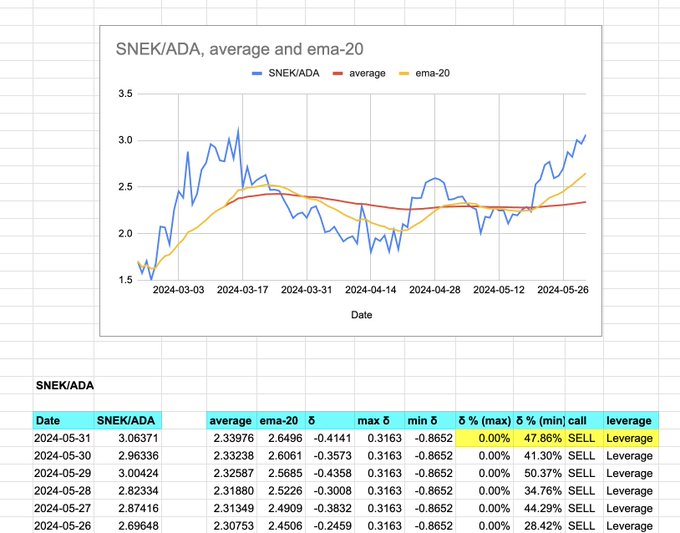

# Daily Reports

## Setup

Make sure you have `FIN_DIR` in your `env` as

* `export FIN_DIR=$CARGO_HOME/ch08/efficacy/data`

Make sure your profile sources 

* [command.sh](src/scripts/command.sh)

## Reports

1. The first report is the quotes of my crypto bag that have prices on
[coinmarketcap.com](https://coinmarketcap.com/). I do this by running
[cmc](src/scripts/commands.sh#24).

The quotes are derived from tokens listed in 
[data-files/csv/portfolio_coins.lsv](data-files/csv/portfolio_coins.lsv).

2. Then I get all the LSD-quotes ('liquid staking derivatives') on @stride_zone
by running [cocaine](src/scripts/commands.sh#23).
3. I update my SPREADSHEETSZORXEN with the @terra_money-data. These data
include Backbone Labs LSDs, @eris_protocol amp-token exchange-rates, and
$LUNA, $ASTRO, and $ROAR price-quotes. These updates are currently all done
by hand, unfortuntately, as @CoinMarketCap does not have $LUNA (it has $LUNC,
which it calls $LUNA).
4. I update @TeamKujira-prices with [kfc](src/scripts/commands.sh#25).

Now the fun begins: analysis, ... after I update all local token prices-quotes
of all blockchains I have positions in (currently, I have positions in 
11 blockchains).

1. Blockaverse report:

* [venn](https://github.com/logicalgraphs/crypto-n-rust/tree/main/src/ch08/charts/venn)
reports of protocol- and token-positions,

* [ont](https://github.com/logicalgraphs/crypto-n-rust/tree/main/src/ch11/ont)ological
snapshot of all positions on all blockchains. This leads to the
[voronoi](https://github.com/logicalgraphs/crypto-n-rust/tree/main/src/ch08/charts/voronoi)
'treemap' (circles in circles) of my stakes.

That's just my first report: the overarching report.

2. All [EMA20-analyses](https://www.investopedia.com/terms/e/ema.asp) 
on all blockchains. This entails:

* 3 ETH/BTC-EMA20 reports (including ETH/USD and BTC/USD)
* 5 ADA/{SNEK, ETH, BTC}, Cardano

* 3 PAXG/{ETH, BTC}
* 4 BNB/{ETH, BTC, PAXG}, Kujira, only, for now.
* 5 AVAX/{QI, ETH, BTC}, Avalanche
* 9 {LUNA, ASTRO, ROAR, BTC, ETH, PAXG}, Terra
* 4 {KUJI, LUNA, MNTA}, Kujira
* 2 ARB/ETH, Arbitrum
* 6 ETH/{OP, SNX, LDO} Optimism ... which has bee a much kinder blockchain
to me than Arbitrum, so far.
* 3 FTM/{ETH, BTC} Fantom, to be rebranded as ... 'S'? ick. There goes that
liquidity.
* 7 { ATOM, OSMO, KUJI, MNTA } on Kujira only, so far.

... that's 51 technical analyses that I generate and share, erryday, folks.

... leading, someday, insh'allah, to

* n Oracle, that automates all of the above. ... maybe even automatically
generates the charts and reports with @TradingView

3. Then I do my pivot-trades on the EMA20s from above.

4. Then I run my [ORCA reports](https://github.com/logicalgraphs/crypto-n-rust/tree/main/src/ch10/orca).
5. Then, you know, I go outside for a walk, touch grass, then work on my latest
novel: the current one is based in [Attu, Alaska](https://www.loran-history.info/stations/Attu/casco-cove/photos/cg-official/cg-photos.html)
... did you know I was at that Coast Guard base in the '90s? It was abandoned
in 2010, come to find.

## Monthly reports

Every month I update my transactional reports.

1. I run [pnl](src/ch08/pnl) ("profit 'n loss") against all my Kujira-trades.

2. I run my monthly transactional yields and expenses report.

3. This leads to my year-to-date statement of my blockaverse portfolio.

