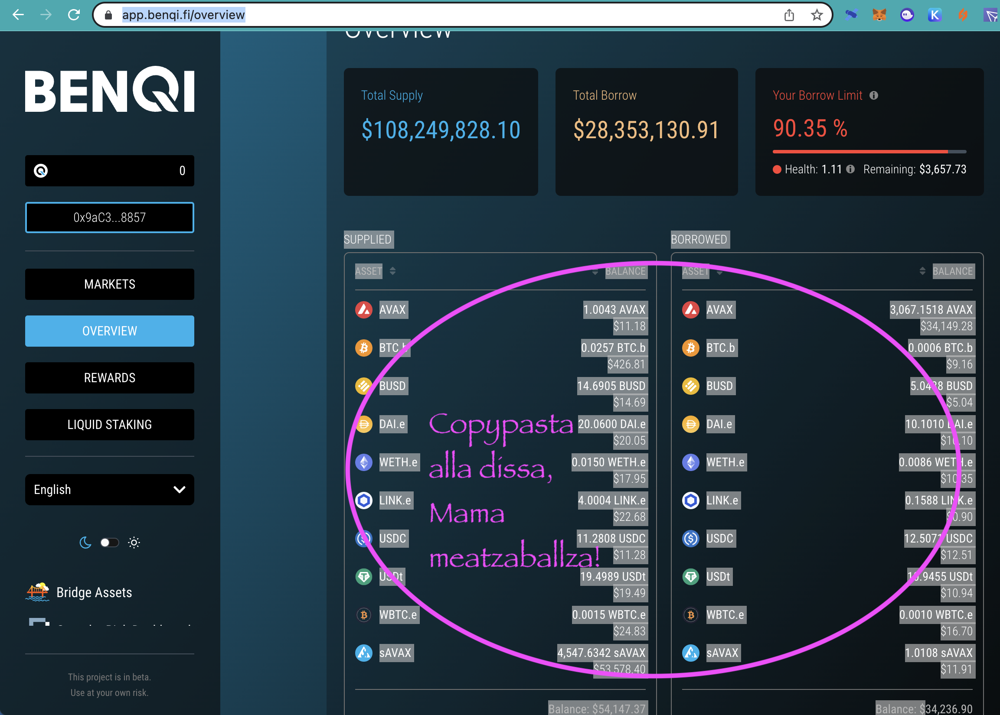
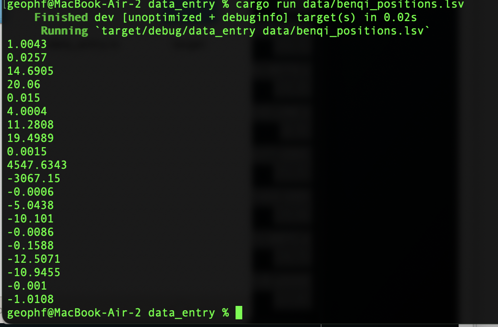

# Benqi daily positions

Reports the positions on all assets (supply and borrow) on the Benqi 
marketplace.

## Setup

1. [BUIDL `stamp`](../../ch04/)
2. copypasta your [Benqi marketplace positions](https://app.benqi.fi/overview)
3. `$ echo '*multiline benqi marketplace*' | stamp > data/benqi_positions.lsv`

## Run

1. `$ cargo run data/benqi_overview.lsv`

You should see a report looking something like this:

which you can copypasta onto your portfolio spreadsheetszorxen, that you 
have establish from anon to accept these positions and suchlike.
