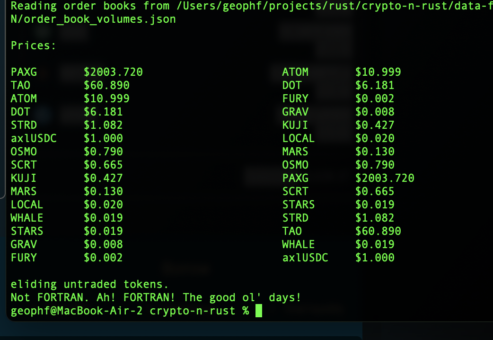

# Bases

Extract the $axlUSDC and $USK market-prices for the order book tokens on 
[Kujira FIN marketplace](https://fin.kujira.app/trade/kujira14hj2tavq8fpesdwxxcu44rty3hh90vhujrvcmstl4zr3txmfvw9sl4e867?q=all).

## BUIDL

1. [BUIDL `tab2csv`](../../ch04/) FRIST!

2. `$ cd $CARGO_HOME/ch08/bases; cargo build`

Make sure you follow the [Setup instructions](../../README.md) (for, you know,
the environmental variables, and stuff)

## RUN

1. copypasta the /tickers market prices to `$FIN_VOLUMES_JSON`
[Endpoint](https://api.kujira.app/api/coingecko/tickers) 

2. `cargo run $FIN_VOLUMES_JSON`

The generated report will look like the following:

