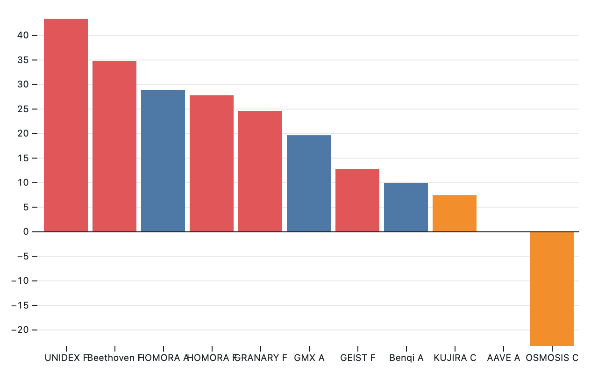
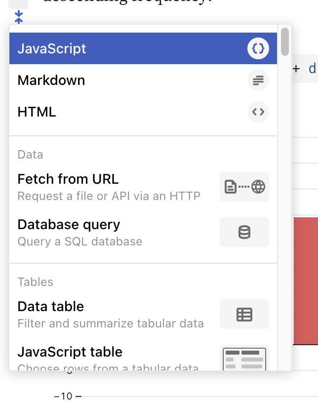

# bar

Generates bar-charts of, well, in this case, protocols and their ROIs.

## How it works

> `$ cargo run <tsv-file>`

It reads a TSV ('tab-separated values') file and generates the observable
Javascript entities that represent a bar-chart of the protocol-by-blockchain
vs. the gain (or loss).

A sample TSV file is [here](data/protocols.tsv).

It renders the following bar-chart:

## What you do with the Javascript

1. Go to the [bar-charts page of 
Observable](https://observablehq.com/@observablehq/plot-bar?collection=@observablehq/plot)
2. Add `protocols` to a new Javascript block. Execute it. (see below)
3. Add `label` to a new Javascript block. Execute it.
4. Overwrite an existing `Plot` Javascript block. Execute it.

## HOWTO add a Javascript block

* Find a `+` on the Observable page.
* select `Javascript ()` (the top option)

* Paste in your code to that new block
* To execute the code, find the arrow on the upper right side of your 
code-block. Select it.

When you add and execute all three code-blocks, voilà: your chart appeareth.

Questions? Problems? contact our sysadmin: > /dev/null.
