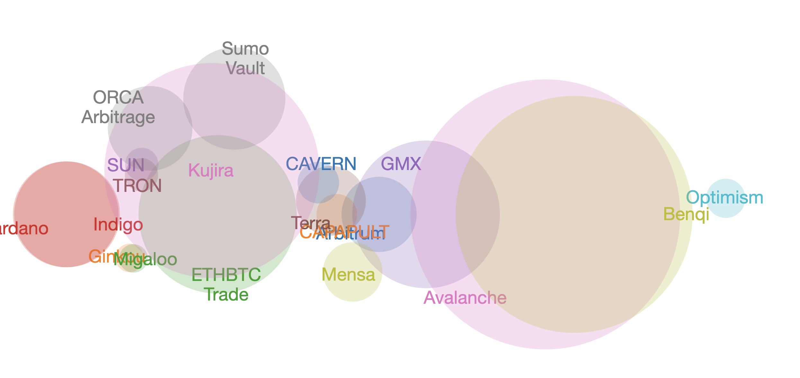

# venn

The structure of these 'books' are as follows, a TSV-file of the form:
   
blah-di-blah,some other stuff,date

protocol/token,blockchain,_invested,value $,other stuff,...

e.g.:
   
```
Blockaverse     portfolio       2024-03-15
                          
Token   Blockchain      invested        value   gain/loss       ROI     real token name rôle
GMX     Arbitrum        $933.00 $682.45 -$250.55        -26.85% GMX
BTC     Cardano $409.29 $867.55 $458.26 111.97% iBTC    blue-chip
```

when you call `./venn` with the above like so:

`$ echo "<TSV data>" | venn [min]`

You get a resulting Venn Diagram that looks something like this:



when run through [venn.js](https://github.com/benfred/venn.js).

... [min] is the minimum value to be included into the Venn Diagram.
