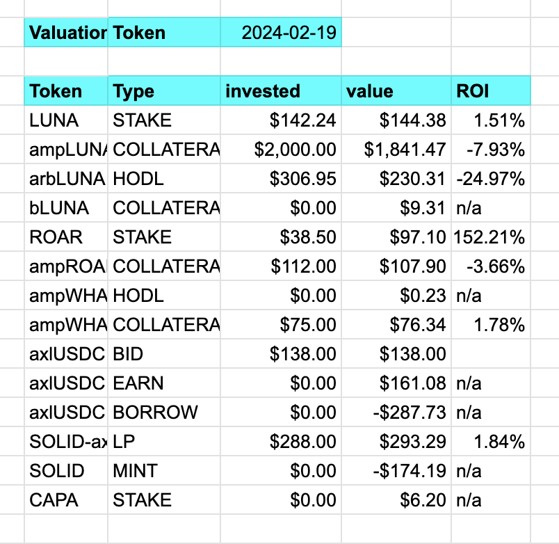

# voronoi

Creates a tree-map from hierarchical data then represents it as a Voronoi-chart.

## Example

Let's say you have a TSV-set of data that looks like this:

And you have [a color palette](../../../../data-files/csv/supported_colors.tsv),
say, stored in the environmental variable <code>$COLORS</code>, as it already
is in [commands.sh](../../../scripts/commands.sh).

You run the ./voronoi program thusly:

`$ echo '<TSV file>' | voronoi $COLORS`

The program outputs Javascript that you can paste into the [Voronoi-site on
d3js.org](https://observablehq.com/@will-r-chase/voronoi-treemap).

Getting you a result that looks something like this:

Try it out!
