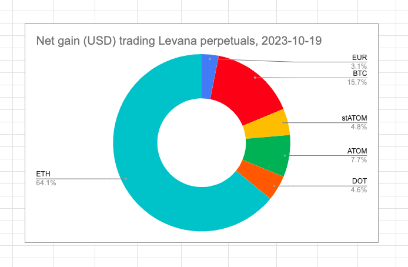
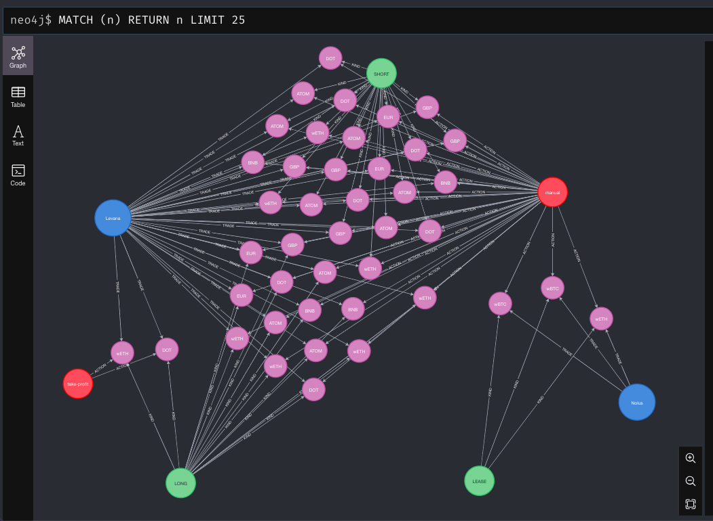

# xform

The problem of representation.

We have a [spreadsheetszorxen](data/trades.tsv) with LOTS of columns. What 
does it represent?

In this case, it's straightforward (kinda?): it represents (leveraged) trades,
particularly, in this case, from Levana and Nolus.

But leverage works in two ways: long and short.

And trades occur multiple times? Over multiple days?

And, plot-twist: Levana allows for take-profit and stop-loss executions, so,
up to now, I've (manually) executed every trade.

So! Representation.

We could represent assets as a donut, but then we lose the long/short-
distinction, or the donut gets cluttered.

So, instead, a graph?

The problem, now, is the representation becomes complicated, showing too much
detail without giving a good grasp of which traded assets, and which types of
trades were the most effective.

No.

That's why I approach this from a Voronoi-representation.

WIP.
