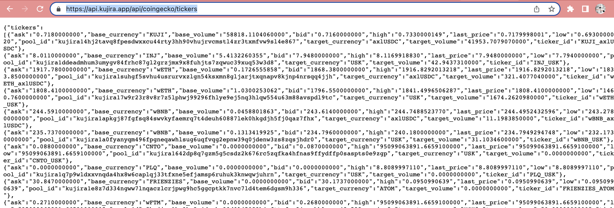
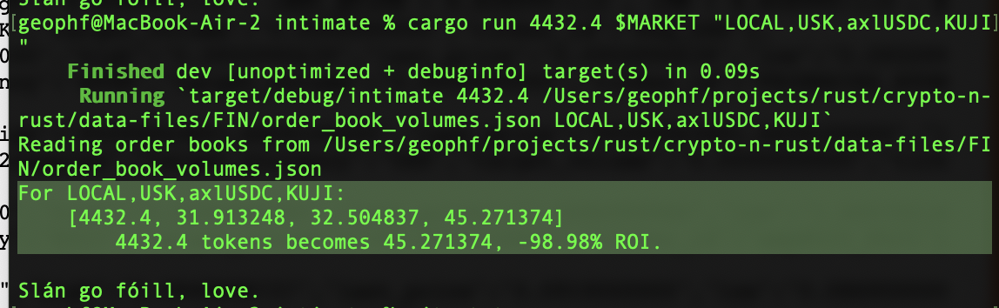

# ./emily

> 🎵 Time it was! Oh, what a time it was. It was ...
> A time of innocence.
> A time of confidences.

> Long ago, it must be, ...
> I had a photograph.
> Perserved her memories.
> They're all that's left me. 🎶

./emily is a trade assistant.

How does ./emily work?

1. You download the current market data from [Kujira REST endpoint](https://api.kujira.app/api/coingecko/tickers)

How I do this is as follows:

> $ echo $FIN_TICKERS

(which gives me the REST endpoint URL)
(I then paste that into a browser 

... and copy-pasta that info thus:)

> $ echo '(market data)' > $MARKET

(I have MARKET exported as my FIN market data file location)

2. You ask ./emily to simulate a trade at current market prices.

Example:

> $ cargo run 4432.4 $MARKET "LOCAL,USK,axlUSDC,KUJI"

to which ./emily replies:

> For LOCAL,USK,axlUSDC,KUJI:
>   [4432.4, 31.913248, 32.504837, 45.271374]
>      4432.4 tokens becomes 45.271374, -98.98% ROI.
>
> Slán go fóill, love.

Of course, the ROI doesn't make sense for this trade. I usually trade in
arbitrage in which case the ROI would provide useful information.

Let ./emily help you with your trades!
