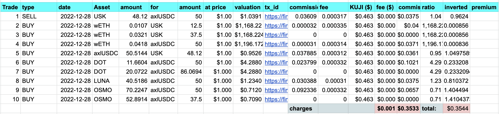
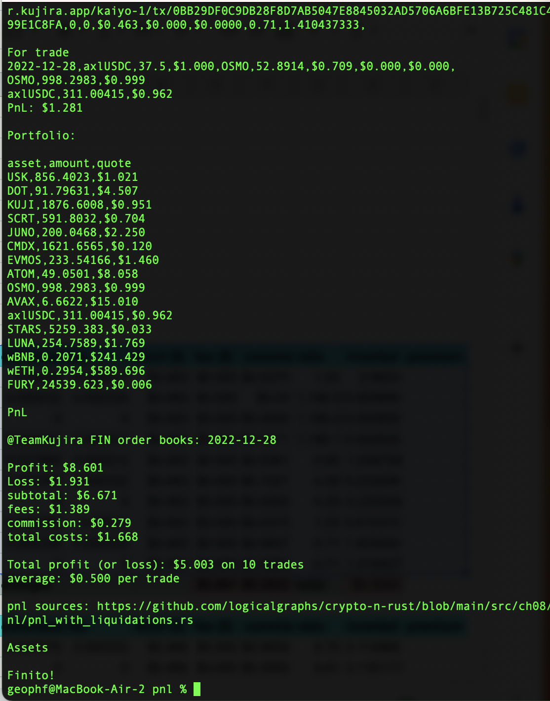
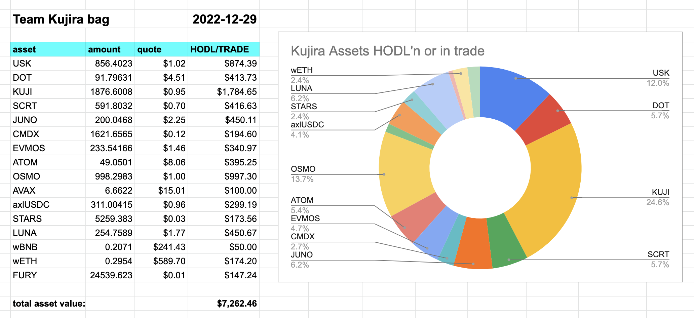

# PnL

PnL ('profit-n-loss') from yesterdæg's Kujira Trades

## Setup

0. [BUIDL `tab2csv` and `stamp`](../../ch04)
1. `$ cd $CARGO_HOME/ch08/pnl; cargo build`
2. establish [your initial assets](data/assets.csv)

## Run

1. copypasta your trades from yesterday. Do not include the last (totals) line.
`pnl` expects CSV with headers:

Trade,type,date,Asset,amount,for,amount,at price,valuation,tx_id,commission,fee,KUJI ($),fee ($),commission ($),ratio,inverted,premium,

where

* `Trade` is the index [1..]
* `type` is one of { BUY, SELL, LIQUIDATION}
* `Asset` is bought
* `for` is sold
* `at price` is sold-price
* `valuation` is formula: 
  * = `sold amount` * `at price` / `bought amount`
* `fee ($)` is formula
  * = `KUJI ($)` * `fee`
* `commisssion ($)` is formula:
  * = `commission` * `valuation`
* `ratio` is formula
  * = `valuation`
* `inverted` is formula
  * = 1 / `ratio`
* `premium` is the liquidation premium and only set if `type` is `LIQUIDATION`

For example:

2. `$ echo '*multiline copypasta'd trades*' | tab2csv > data/trades.csv`
3. `$ cargo run data/assets.csv data/trades.csv`

Your report should look something like (includes per-trade run-off):

## Follow through

1. copypasta the output assets with headers
2. `$ echo '*multiline assets CSV*' | stamp > data/assets.csv`

This establishes current state of your bags for tomorrow's yesterday's 
daily trade report.

And I just unironically wrote "tomorrow's yesterday's." I didn't even blink.

## Oh, and by the way, ...

You can do more than just copy-pasta the assets into `data/`. You can, for
example, upload the CSV into an analytics-tool, like, ... [dare I say] ...
a SPREADSHEETSZORXEN! then view your bag which will allow you to see your
portfolio balance and prominent assets in your bag, e.g.:

