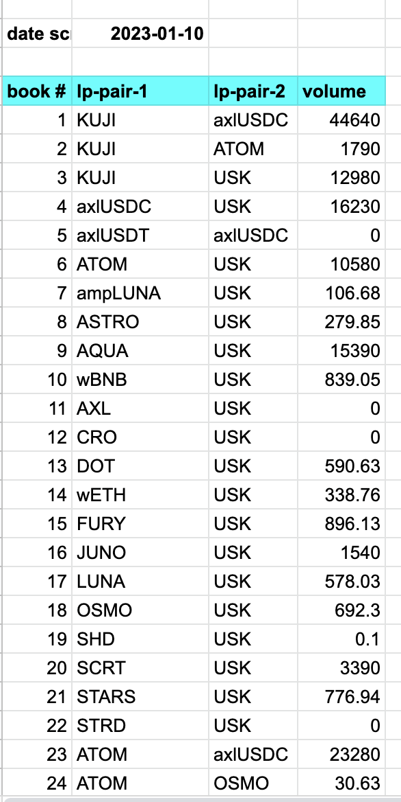

# Rusk

A little Rust reader that reads @TeamKujira FIN order books and their volumes 
(volumes written in estimated-form, e.g.: 15.7k) and outputs the same. 

usage:

   `$ ./rusk <file>`

STILL a lot of manual labor, but, we now have this!

volumes reposed [here](data/volumes.csv).
