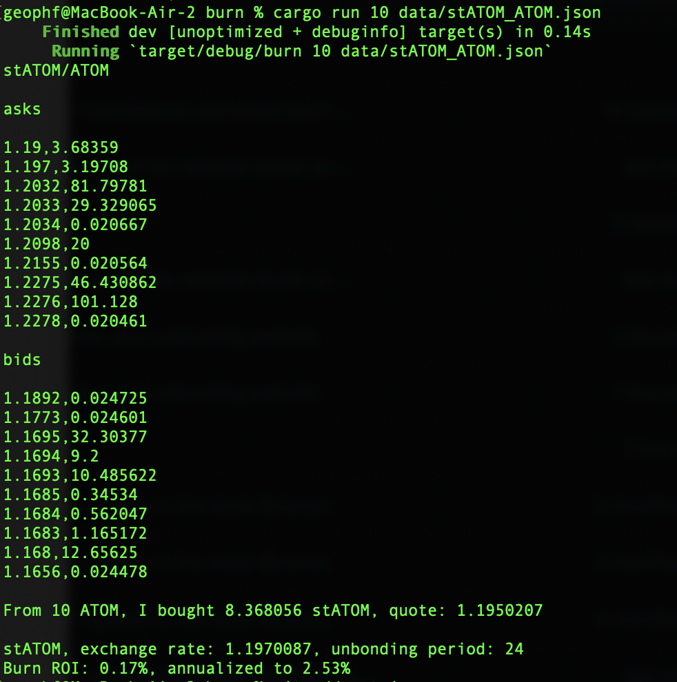

# burn

Computes burn ROI and APR, given you have the JSON of the LSD order book.

`$ ./burn <ntoks> <order book>`

`./burn` fetches the @stride_zone LSD exchange rates and unbonding periods, then computes
ROI and APR from the number of tokens you used to buy LSD tokens from the order book.

