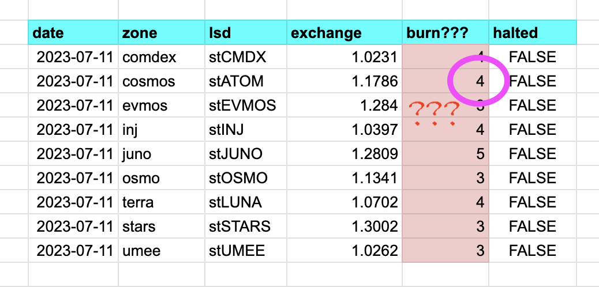

# lsd ('Liquid Staking Derivatives')

Reads the st-tokens, their zones, their exchange- and burn-rates from the
@stride_zone REST API endpoint.

You provide ./lsd with today's date, ./lsd goes to @stride_zone REST API
endpoint, parses the JSON, and extracts the above values.

n.b.: the burn rates are very strange. Do not use for arbitrage computations!

