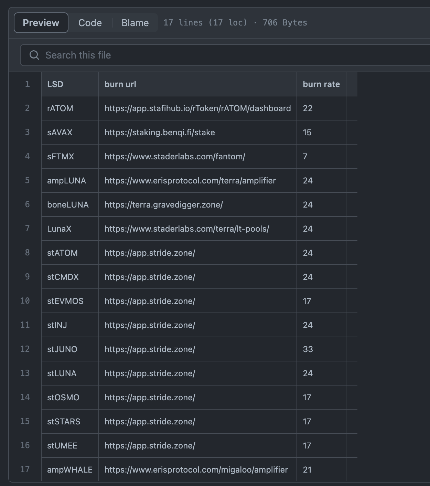
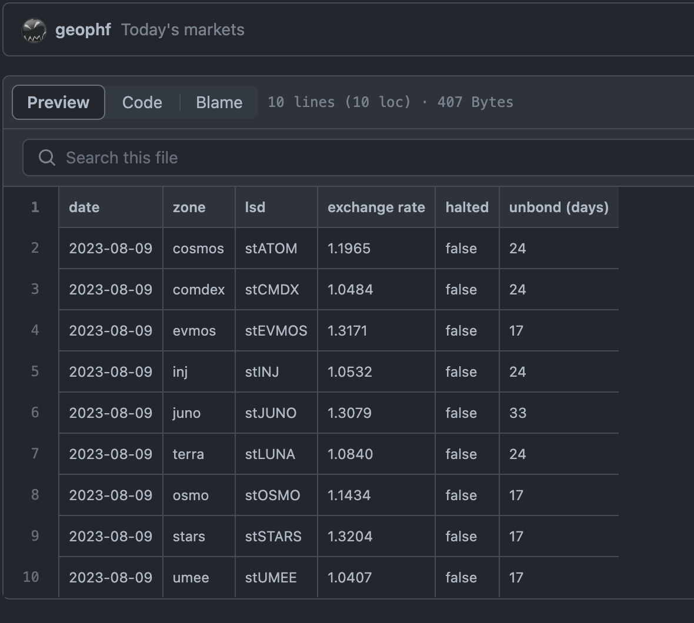

# lsd ('Liquid Staking Derivatives')

Reads the st-tokens, their zones, their exchange- and burn-rates from the
@stride_zone REST API endpoint.

You provide ./lsd with today's date, ./lsd goes to @stride_zone REST API
endpoint, parses the JSON, and extracts the above values.

[LSD token burn rates](https://raw.githubusercontent.com/logicalgraphs/crypto-n-rust/main/src/ch09/lsd/data/burn-rates.csv) are what I dredged up from around-about.

`./lsd` reads the burn rates and the @stride_zone REST endpoint and provides an [integrated and comprehensive report of Stride LSDs](https://raw.githubusercontent.com/logicalgraphs/crypto-n-rust/main/src/ch09/lsd/data/stride.csv) for `date`.

From thence you can compute ROIs and APRs should you choose to burn your LSDs back to the sourced tokens.