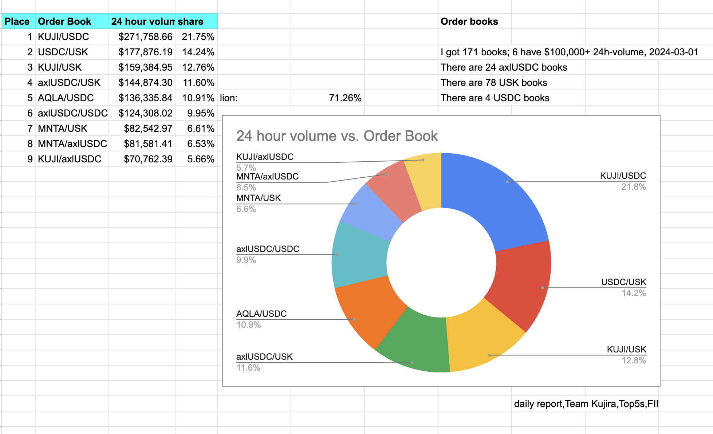

# top_order_books

Computes the top order books by 24-hour volume from @TeamKujira FIN order book
data obtained from the 
[tickers REST endpoint](https://api.kujira.app/api/coingecko/tickers).

`$ ./top_order_books [--raw] <date> [minumum volume=50000]`

The <code>--raw</code>-option shows all the order books and their 24h-volumes.

## revisions

* version 1.2: dust() eliminates books from the report below 5% daily volume.
* version 1.1: corrected volumes to be based off of the target price.
