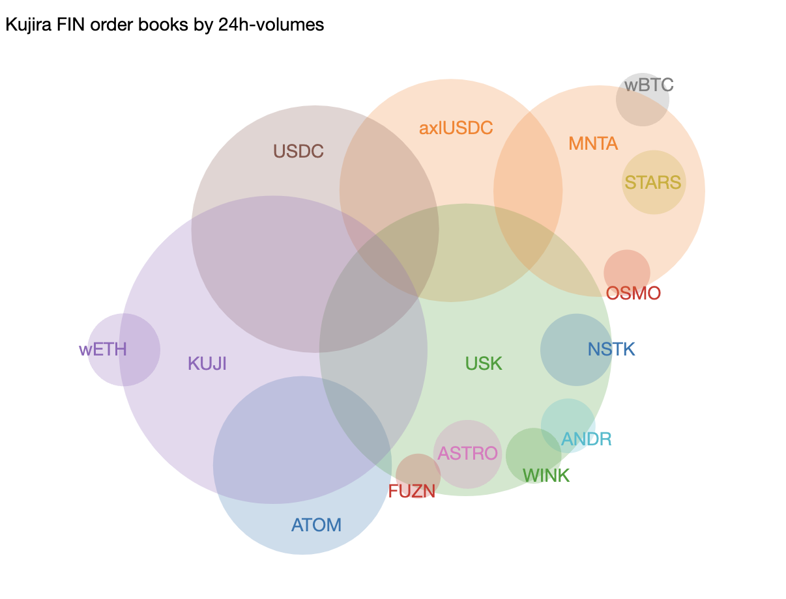

# top_traded

What are the top-traded tokens on Kujira FIN?

A Venn data-visualization.

`$ ./top_traded <date>`

gets you (something like) this:

`./top_traded` takes the 
[json from the tickers REST API endpoint](https://api.kujira.app/api/coingecko/tickers)
and spits out the Venn diagram spec consumable by 
[venn.js](https://github.com/benfred/venn.js)

The Venn diagram output spec is as per:

`var sets = [ {sets: ['A'], size: 12}, 
             {sets: ['B'], size: 12},
             {sets: ['A','B'], size: 2}];`

and is a `.jsonp`-file.
