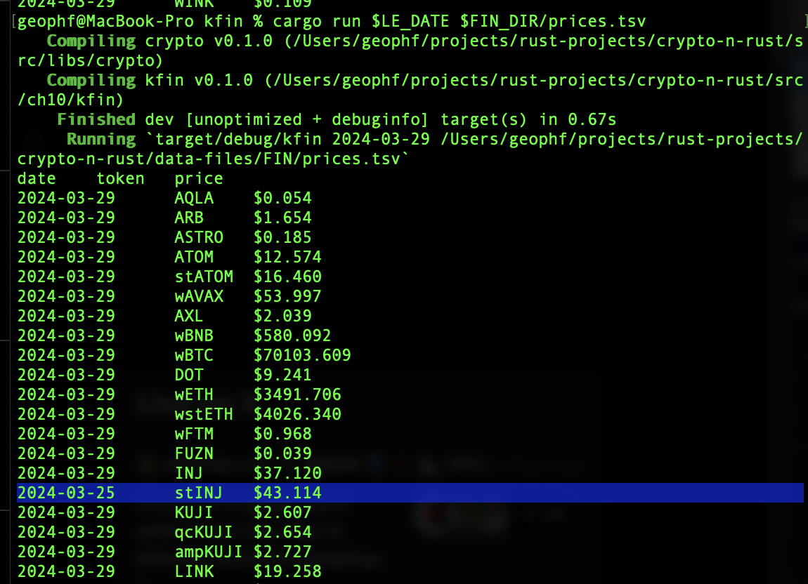

# kfin

(not the first two letters reversed)

(that's something else)

Reads the Kujira FIN prices from the REST endpoint and publishes only those
prices in your portfolio.

`./kfin <date> <prices.tsv>`

An example `prices.tsv`-file is [here](../../../data-files/FIN/prices.tsv).

## Revisions

2024-03-29: prices updated reflect which date they were updated

