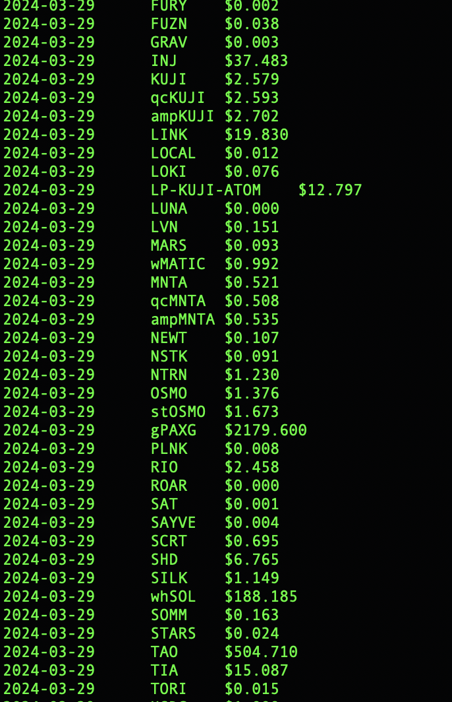
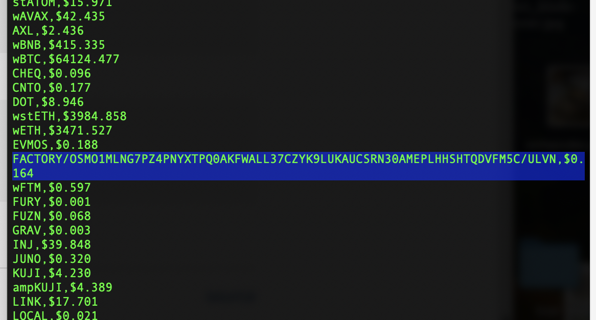

# prices

From the 
[Kujira FIN REST endpoint](https://api.kujira.app/api/coingecko/tickers),
computes the prices of the actively-traded tokens.

"Actively-traded" be more like "traded at all in the last 24-hours."

n.b.: Although `prices` takes into account all order books to compute 
token-price, it is $axlUSDC-biased.

Usage:

`$ ./prices <date>`

renders something like this:

The [aliases CSV file](../../../data-files/FIN/aliases.csv) exists to deal
with the REST endpoint sending back, say, a factory UUID instead of the
token-name LVN for the Levana protocol token, as you see here:

This was a rather fun app to write, except for my foray into trying to make
iteration over HashSets and Vecs generic, and the (non-extant) copy-semantics
for my Book-type had me rewriting `partition()` by hand. Ick.

On the plus-side, I did some neat compositions with higher-order functions,
particularly with `mb_book()` and `mb_price()`. And I found chaining HashMaps
together to be an elegant approach to solving the prices-problem.

## Revisions

2024-03-29: refactored crypto::types::books into 17 files 😱😱😱 `./prices`
now provides the date that the token-price was recorded.
