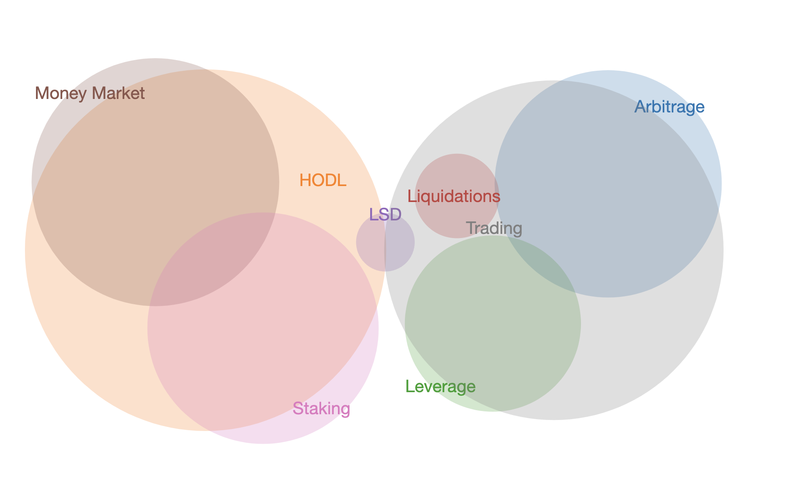

# dom

As liquidity deployed across the Blockaverse can be purposed to several
intersecting domains, a pie-chart is not an accurate representation to show
overlapping concerns.

When we query the ontology with [`dom.cyph`](cypher/dom.cyph), we receive
liquidity deployed as per the domains, but at the protcol-level.

The results come in the form of [`records.json`](data/records.json).

I wish to see what liquidity is deployed to which (intersecting) domains, ...
AND THEN represented in the
[sets-representation of venn.js](https://github.com/benfred/venn.js).

An example output from the input `records.json` would formatted like
[`venn.js`](data/venn.js).

This way, we could then represent liquidity deployment as a Venn diagram:

The above is rendered from the file output from:

`$ dom data/records.json > $VENN_DIR/crypto.js`
