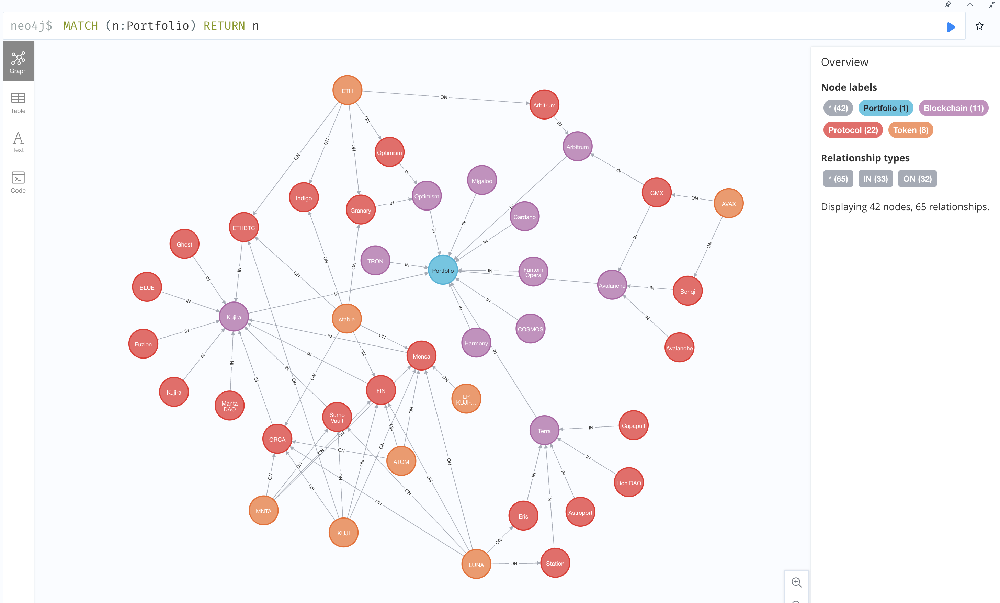
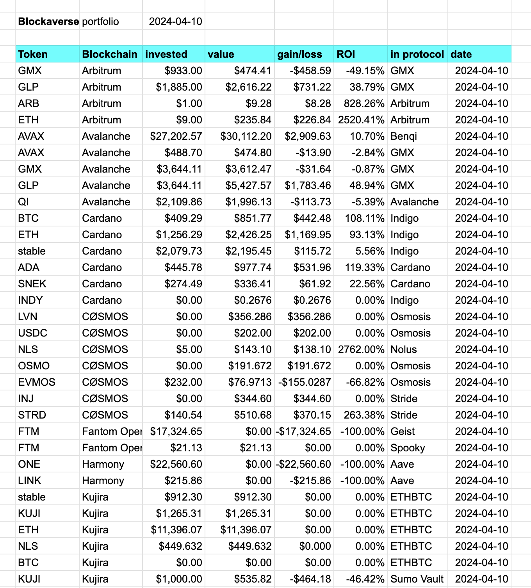
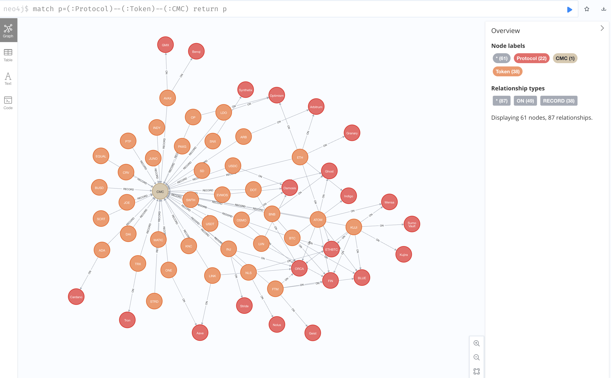
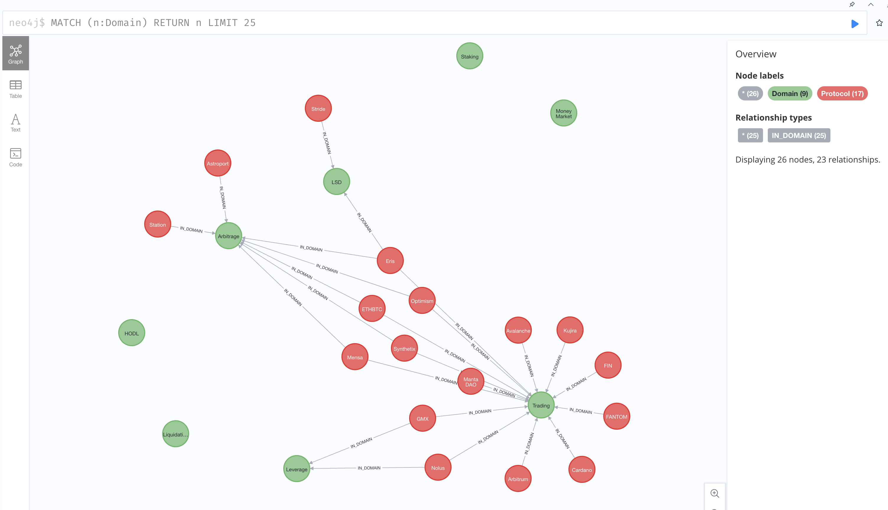
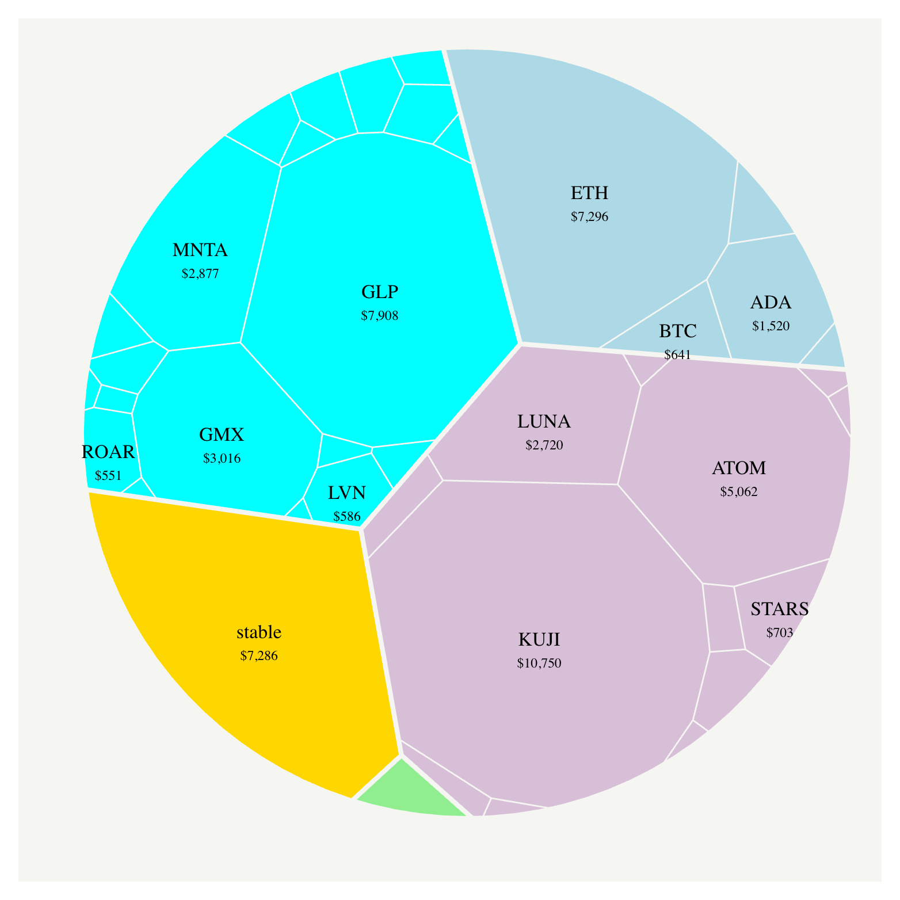

# ont

Creates an ontology of your cryptocurrency portfolio. 

Your portfolio is recorded in the form of the following:

`$ echo <portfolio TSV> | ont`

n.b.: Don't pass in the headers, just the portfolio data.

This repository also has [a script](cypher/cmc.cyph) that represents which 
tokens are recorded from [CMC](https://coinmarketcap.com/), which then renders
interesting graphs, such as the following:

## Queries

Now that I've captured my portfolio data as a graph, there are several 
interesting representations that fall out, such as:

* How much is each protocol worth? / TVL?
* How much do I have in each blockchain?
* Which tokens are in which blockchains?
* How much do I have in each token?

A [domain-query](cypher/dom.cyph) overlays `Domains` onto protocols,
providing aspects, such as `Trading`, `Arbitrage`, `HODL`, `Leverage`, and
other domains, to query into the ontology:

## Video

I do a walkthrough of using `./ont` and navigating a knowledge-graph in my video
[Portfolio as Ontology](https://www.youtube.com/watch?v=Hw6o-pJ-EsE).

## All coins as Voronoi chart

1. Upload the Blockaverse portfolio ontology (`./ont`)
2. Upload the [token-kinds](cypher/token-kinds.cyph)
3. In your [neo4j](https://neo4j.com/) graph database, [query the coin-kinds](cypher/coins.cyph), then `export CSV`.

This will create `$HOME/Downloads/export.csv`

4. Run [`./vorn.sh`](../../scripts/vorn.sh) (found in `src/scripts/`)

That generates this --v (see [`./voronoi`](../../ch08/charts/voronoi))

