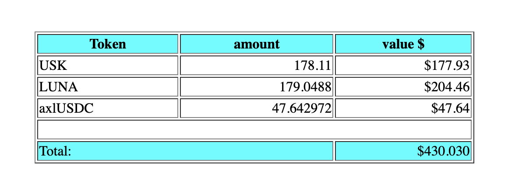

# tabla

Takes a copypasta from a SPREADSHEETSZORXEN! and converts those rows of data
into an HTML-table.

## e.g.

<code>
$ echo 'Token	amount	value $
USK	210.84	$210.63
LUNA	179.0488	$204.46
axlUSDC	47.642972	$47.64' | tabla 2
</code>

The output from the above would look like this:

n.b.: the parameters are optional: they total the indicated columns. The 
columns are zero-indexed-based, e.g. `2` indicates the third row; _capice?_

The. End.
