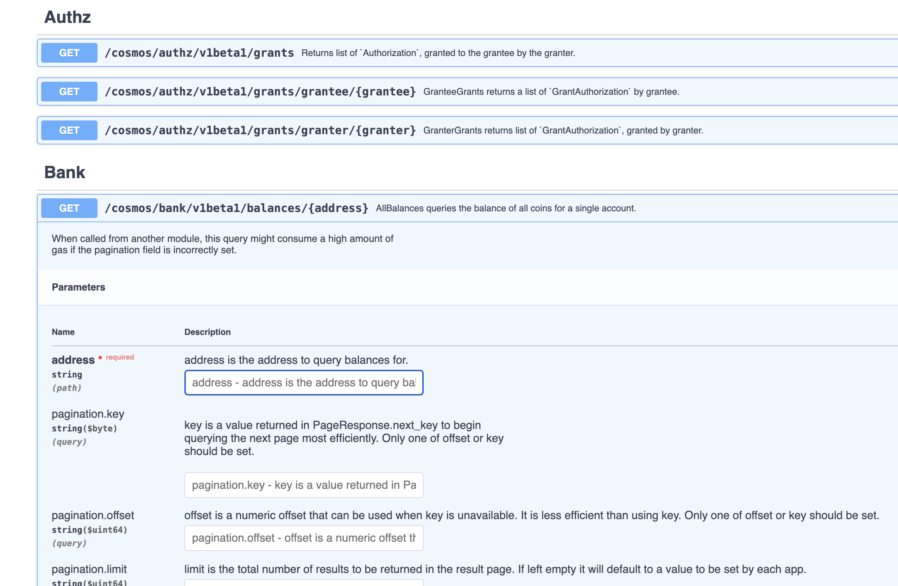

# all_balances

Queries the swagger endpoint to get all balances for a wallet addy

## problem statement

Rust pop-quiz:

@terra_money has a 
[swagger endpoint](https://lcd-terra.tfl.foundation/swagger/#/Bank/AllBalances)
where you can query bunches of things.

Write a Rust program to query your wallet's balances. Notice anything weird?

Does @TeamKujira have a swagger endpoint to make such queries?

* ([answer](answer.md))
