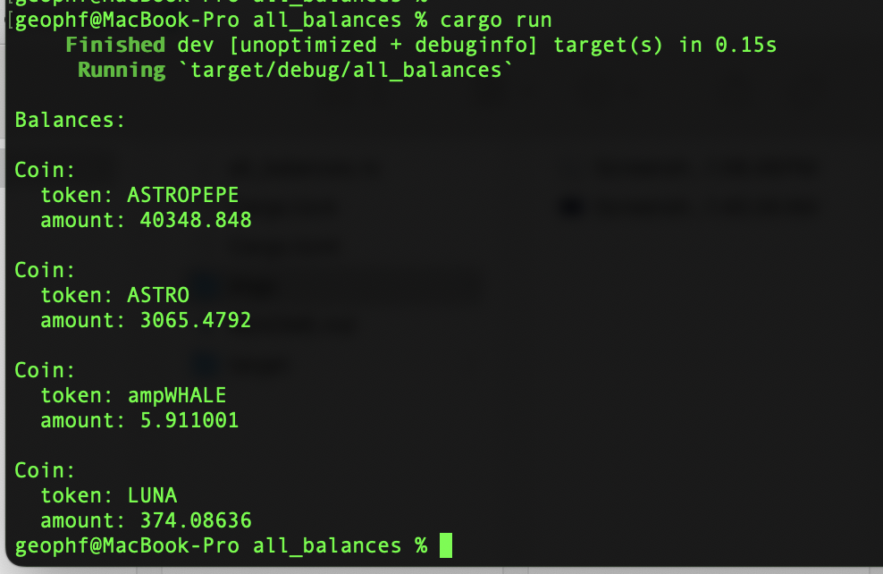
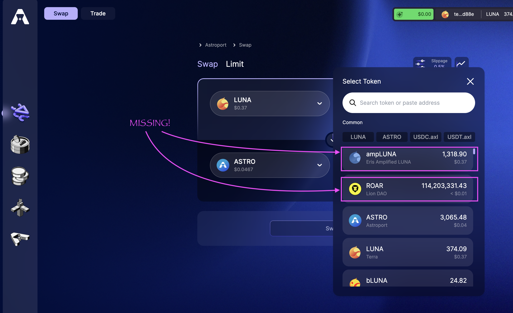

# Answer to Terra all_balances

This is a simple swagger-call at base, ... which I 
[embellished](https://github.com/logicalgraphs/crypto-n-rust/blob/cosmwasm/src/cosmwasm/terra/all_balances/all_balances.rs#L41) 
(converting obvious numbers from strings), then 
[embellished again](https://github.com/logicalgraphs/crypto-n-rust/blob/cosmwasm/src/cosmwasm/terra/all_balances/all_balances.rs#L29-L38) 
(converting denom to token ... by hand), then 
[embellished one more time](https://github.com/logicalgraphs/crypto-n-rust/blob/cosmwasm/src/cosmwasm/terra/all_balances/all_balances.rs#L46-L49)
(adding a pretty-printer to the Coin-type).

One, very major, thing to note is that `all_balances` doesn't give me all
balances: I'm missing much more than half my wallet's value in the response,
as a simple dropdown from an @astroport_fi swap readily shows that $ampLUNA
and $ROAR (among other tokens) are missing.

Oh, well.
