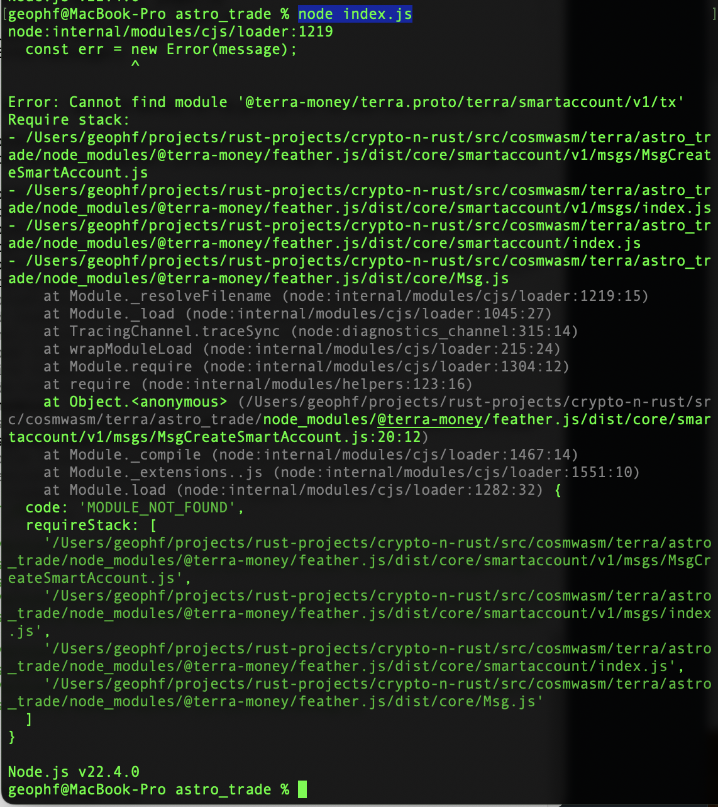

# astro_trade

Here we follow the 
[@astroport_fi tutorial](https://docs.astroport.fi/docs/develop/tutorials/trading/swapping)
to executate a trade, in this case on `testnet`.

We're following the @astroport_fi example by rote for now. First, we'll get
the thing working from their example. From thence, we'll add improvements.

So, that means Javascript for now, m'kay, bunky?

## Archive

### The problem

2024-07-18

When I try to run the first part of any part of any demo: connecting the
wallet, I get the following `MODULE_NOT_FOUND` error:



Not having `tx` is a show-stopper. I've reached out to the @astroport_fi-team
on twitters. Until I get this resolved, I'm dead in the water.

### ... and the solution

2024-07-25

According to 
[@TheAmazinCrypto tweet](https://x.com/TheAmazinCrypto/status/1816255241534280087),
the problem with feather.js manifests in the latest version. Rolling back with:

```BASH
npm install @terra-money/feather.js@2.0.2
```

finally gets the application working with the following output:


