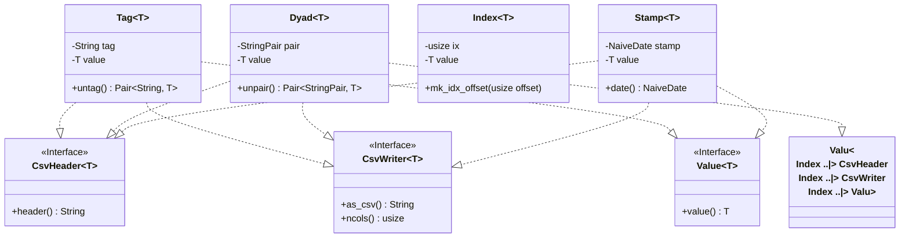

# types

A set of types used throughout the book. All these types are 
[csv-able](../csv_utils.rs).

* [Tag](tagged.rs)

> A tagged-type: a value that has a tag/associated-descriptor/key

* [Dyad](dyadic.rs)

> A tagged-type where the tag has a primary and secondary key.

* [Index](indexed.rs)

> A value with an `usize` index

* [Stamp](stamped.rs)

> A date-stamped value

* [Value](values.rs)

> Any type that carries a value, or: a comonad

