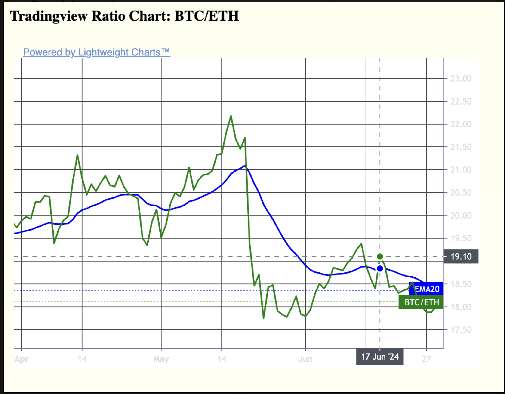
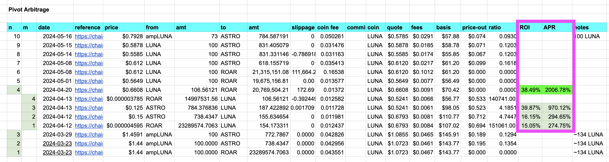

# pivot

A very slow 'arbitrage'-trade from one token, back to that token, via a 
pivot-token.

## Components

* [gecko](dApps/gecko) - fetches token-prices from coingecko REST API endpoint
  * [lizard](dApps/lizard) - for when you miss a day, ... or few: grabs price-history of all pivotable tokens
* [status](dApps/status) - formats the latest crypto prices for reportage
* [ema](dApps/ema) - analyzes two-token ratios
* [rekt](dApps/rekt) - BUY / SELL call
* [tok](dApps/tok) - adds a new token to 
[$PIVOTS](../../data-files/csv/pivots.csv)
* [dawn](dApps/dawn) - runs recommendations on all pivot pools
* [dusk](dApps/dusk) - checks for open pivots to close
* [otto](dApps/otto) - converts reserve liquidity to pivot assets daily

## Determinor

The determinor to execute the trade is the
[EMA](https://www.investopedia.com/terms/e/ema.asp)-20 ratio between the
traded-token and the pivot-token.

The determinor of how much to trade is the ratio between current δ to the
max (or min) δ.

The practice of this type of trading which I call pivot-trading or 
pivot-arbitrage, is that: once a day, I check the EMA-20s then execute
the trades based upon those indicators.

## Efficacy

The way that I know this strategy /works/ is that I compare like-for-like:

If I traded 10 $AVAX for, say, 16,000 $QI on day x, then, days, weeks, or 
months later, on day y, ...

> (I did say this was 'very slow,' didn't I?)

I trade-back the 16,000 $QI for 11.5 $AVAX, I then have an ROI of 15%

> (11.5 - 10) / 10 = 15%

and the APR of ROI * 365 / (y - x)

This way I measure the success of my pivot-arbitrage.

[disclaimers](disclaimers.md)

## Timeline

### Completed

1. Fetching/reporting data: DONE! ✅ 2024-06-21 (gecko, status)
2. analyzing data (ema)
3. charting pivots
4. making pivot-trade recommendations

### Long-term

5. automate trades
6. APR reportage
7. Protocol/DAO/token-launch

## Quizzes

I show how to BUIDL this system from the ground up in a series of
[quizzes](quizzes).

## NEWS FLASH!

2024-06-11: upgraded to reqwest::0.12.4 and made all RESTful calls asynchronous.
