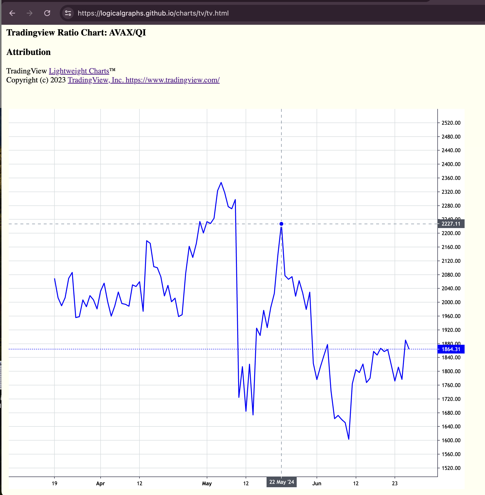
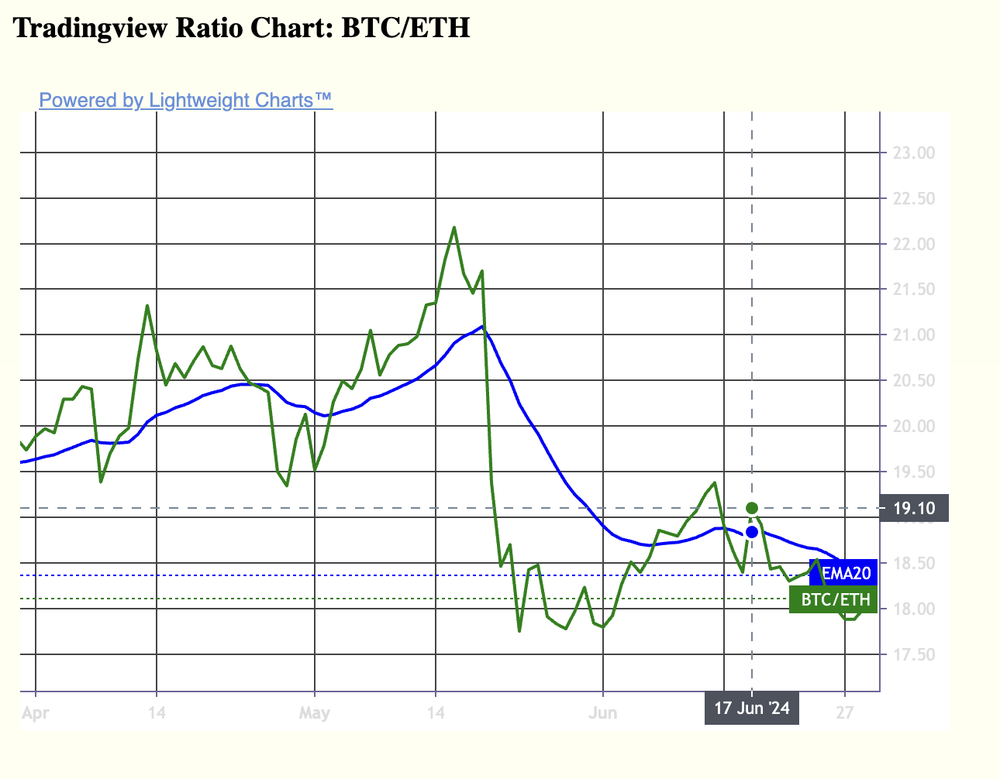

# ema

## Analyzes two-token ratios and chart the results

I do my pivot-trades along the 
ratio-vs-the-[EMA](https://www.investopedia.com/terms/e/ema.asp)20 δ.

`ema` computes the EMA20 along the pivot, then provides the data (formatted
as Javascript object-arrayed data). In [quizzes](../../quizzes) I explain the 
structure and design of `ema`.
