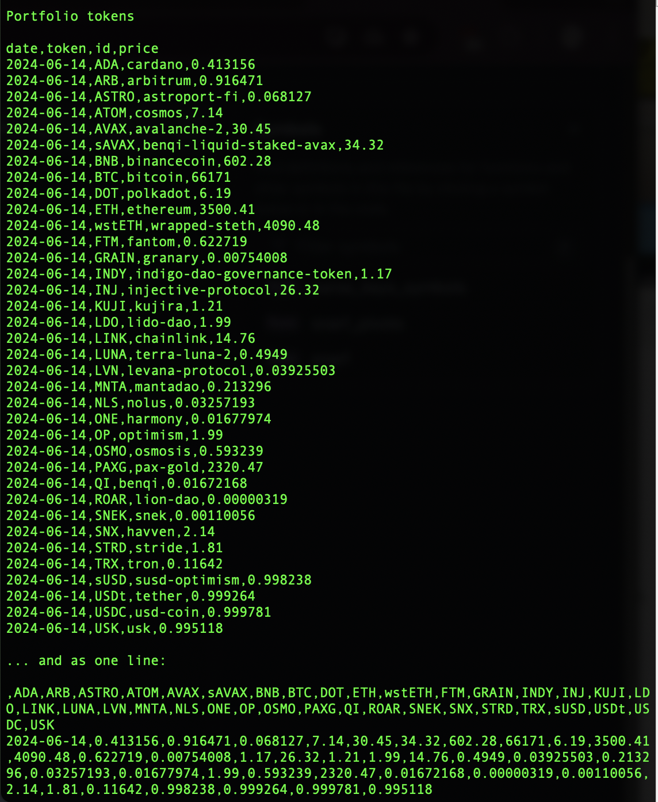

# gecko

`gecko` reads the token-prices from coingecko REST endpoint.

"Which token-prices?" you ask.

Fair question.

It reads the token-prices for the coingecko API IDs listed in
[`$PIVOTS`](../../../data-files/csv/pivots.csv)

As this dApp accesses the coingecko API, an authetication is required. I put
the authentication-token into the `COIN_GECKO_API_KEY` environmental variable.

## Construction

I demonstrate building this dApp through a [series of quizzes](../../quizzes).
Working your way through these quizzes talks to its design.
