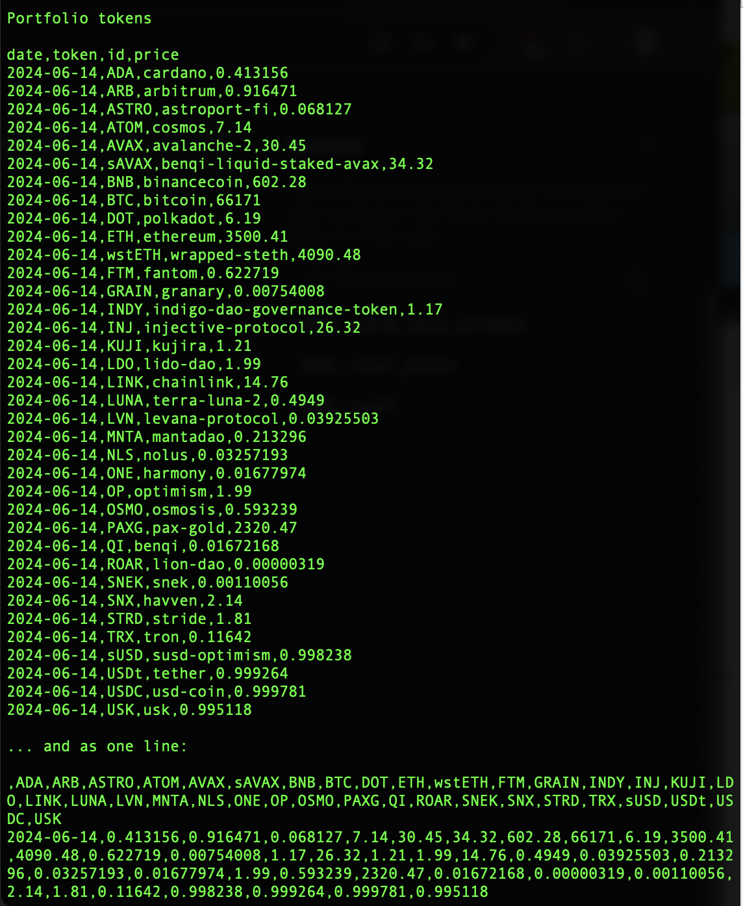

# gecko

`gecko` reads the token-prices from coingecko REST endpoint.

`$ gecko <date> [branch]`

where:

* `<date>` (required) is the date for which you want to stamp the quotes fetched
now. `$LE_DATE` renders today's date.
* `[branch]` is the branch of the repository from which to fetch which quotes
to fetch (defaulted to `main`).

"Which token-prices?" you ask.

Fair question.

It reads the token-prices for the coingecko API IDs listed in
[`$QUOTES`](../../../data-files/csv/quotes.csv)

As this dApp accesses the coingecko API, an authetication is required. I put
the authentication-token into the `COIN_GECKO_API_KEY` environmental variable.

## Construction

I demonstrate building this dApp through a [series of quizzes](../../quizzes).
Working your way through these quizzes talks to its design.

-----

# Revision history

... uh, ... starting versioning now!

* 1.03, 2026-08-06: added gecko-banner for help-output
* 1.02, circa 2026-06: Added comma-float-parsing and CLAP
* 1.01, circa second-half 2025: transitioned from 'pivots' to 'quotes'-concept.
* 1.00, circa 2024: released

