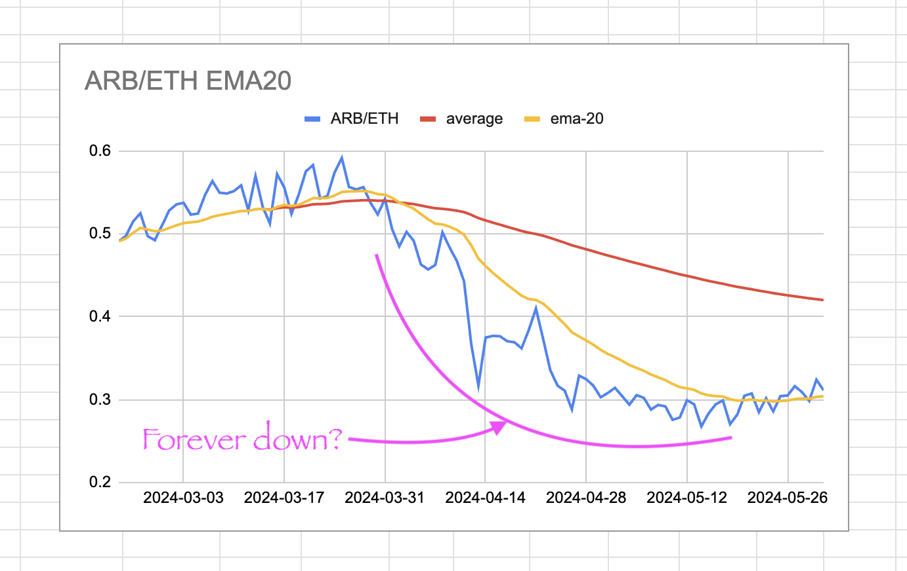

# rekt

Makes BUY/SELL-trade recommendations for pivot-trades.

`rekt` is so-called because if you just blindly follow these recommendations,
neither knowing the how behind these calls nor trading 
[coins of value](https://logicalgraphs.blogspot.com/2022/03/value-dialog.html), 
then you're gonna get rekt, and it'll be all your fault.

Dependence on any automaton implicitly accepts the model within which the
automaton operates, and all models, by definition, are ... _wrong_ ... it's
just that some models inform us better than others.

_caveat emptor, ... LITERALLY!_

## HOW

The way `rekt` works is that it uses the
[EMA](https://www.investopedia.com/terms/e/ema.asp)20-vs-the tokens ratio,
thusly:

* When the EMA20 is _above_ the ratio, this indicates the _current 'price'_
(ratio) is _below_ the trend, indicating a bargain: *BUY*!

* When the EMA20 is _below_ the ratio, this indicates the _current 'price'_
(ratio) is _above_ the trend, indicating your token is overpriced: *SELL*!

## Assumption

Now, this whole approach depends on an assumption that both tokens of the
pivot are _tokens of value_. What do I mean by this? I mean that one token
may go down in value relative to the other token of the pivot for a while,
but (and here's the assumption), the first token will _eventually_ bounce back,
and its value will return above the second's.

The assumption, then, is we have oscillating values of the token-pair pivoted.

## Risk

If the first token _never_ bounces back in value, then what happens is the
second token is drained, eventually, to zero, buying the first token that,
itself, devalues with respect to the second. I've seen this play out with
Ψ-LUNA, Ψ-ETH, GRAIL-ONE, and ECHO-rETH, where the protocol token (Ψ, GRAIL,
and ECHO) plummet in value, and I got an inordinate amount of those devalued
tokens but lost my $LUNA, $ETH, and $ONE.

I was afraid, for more than a month, that the ARB/ETH pivot was a bad one,
because I kept trading $ETH for $ARB as $ARB's value continued to slump as
compared to $ETH's.

*That's why* pivot-arbitrage/trading works only when _both_ tokens are tokens
of value.

How do you know a token is one of value? A rule of thumb is that it's a token
of value if you don't mind getting it in exchange for the base-token.

That's why BTC/ETH LPs are things of wonder! No matter which side is strong,
I don't mind getting a lot of the other token in balance.

## rekt in action

Here's `rekt` in action. One of my queries is "Using the past 100 days of
price-data, do I buy or sell $KUJI with $OSMO?"

`rekt` replied:

> On 2024-07-03, SELL KUJI for FTM

So, ... yeah. That.

## δ-confidence

Besides computing the buy/sell-call, `rekt` computes the confidence or
proportion to buy or to sell using the δs between the EMA20s and ratios.

With the δs computed, `rekt` now renders a degree of confidence to the call.

## TODO

Two directions:

1. I've got to get charting of δs working on TradingView
2. I need to translate confidence into amount to trade and amount expected
in return by, eh: computing how much of a and b I have (in my wallet with
a blockchain query?) verses the prices of each. I have the prices already, and,
in fact, I only need today's base price, as the EMA20 entails today's ratio
(so the other price is unnecessary to compute the target-amount).

I got a bit pensive there, but that's what's next.
