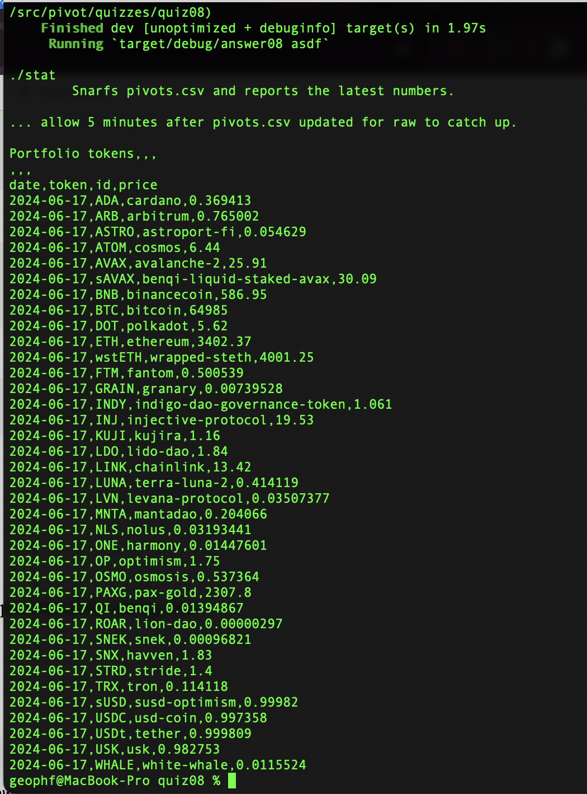

# status

`./status` reads [pivots.csv](../../../data-files/csv/pivots.csv) and prints a
portfolio-report of the most recent token-prices.

> *hint:* wait 5 minutes after pivots.csv is updated in github for the 
raw-representation to update.
