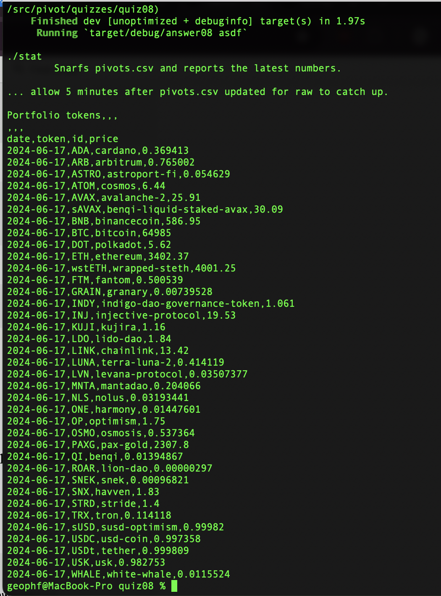

# status

`./status` reads [quotes.csv](../../../../data-files/csv/quotes.csv) and 
prints a portfolio-report of the most recent token-prices.

> *hint:* wait 5 minutes after quotes.csv is updated in github for the 
raw-representation to update.
