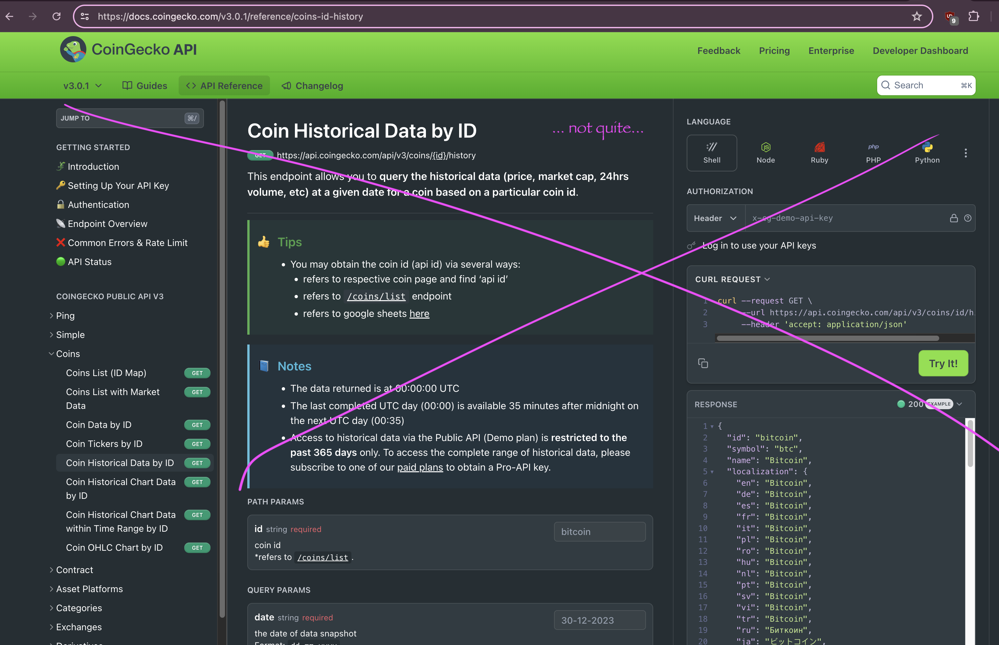
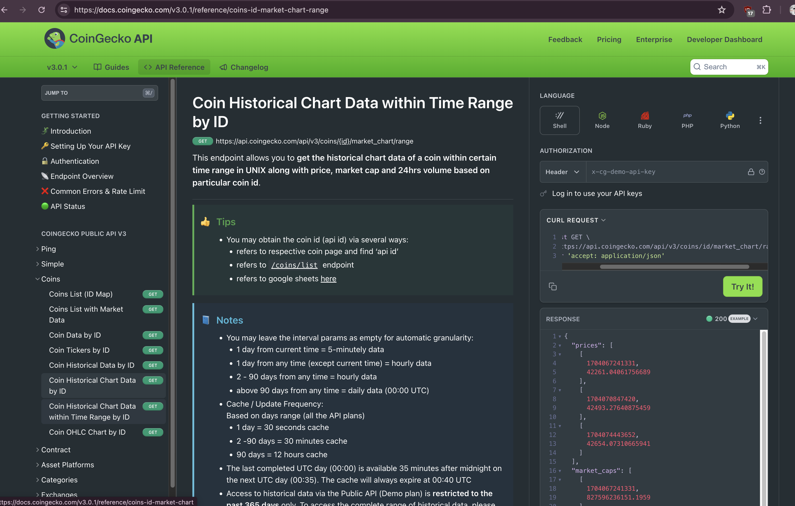
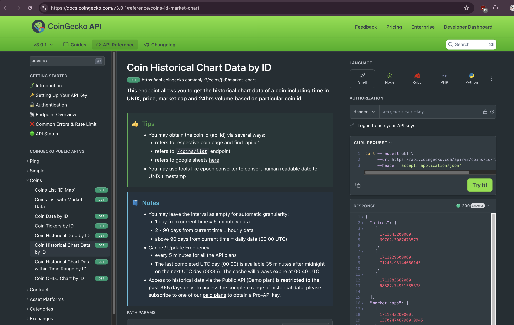
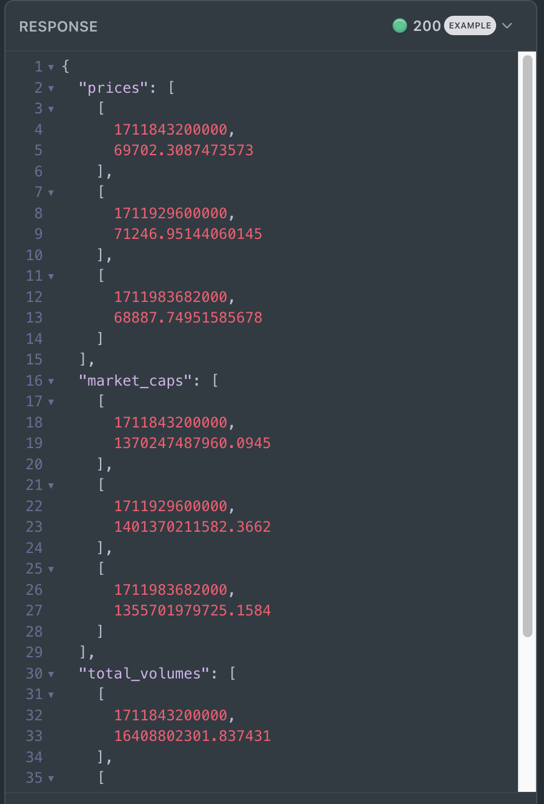

# BUIDLn `lizard`

## Posing the question

#Rust pop-quiz

[`gecko`](../gecko) gives me today's prices for the tokens in my portfolio, 


... but if'n I'm missing prior days' prices, it's of no help.

Instead of spending HOURS backfilling, let's write a program, `./lizard`, 
that does that backfill.

Go!

## Solution: the process

Let's step through how I go about answering these problems.

First, I find where I can get the raw data I need. The first place I go to is 
[@coingecko's API](https://docs.coingecko.com/v3.0.1/reference/coins-id-history ).



This isn't quite what I'm looking for: I'd need to make a REST call for every 
single date. Ick.

Fortunately, @coingecko has two REST endpoints that return prices over multiple 
days. The 
[first](https://docs.coingecko.com/v3.0.1/reference/coins-id-market-chart) 
returns prices for the last x days; 



... the second, within a date-range.



My use-case is the former (last x days), so let's go with that one.

What is the above process?

1. If you're not getting the data you need, there may be the data you need 
elsewhere. Look around first.
2. If the data is icky, anyway, just deal with it, and code a transformer to 
unickify it.

Always prefer the former to the latter.

### Good Coding Process

Too many developers make this mistake:

> "If I haven't coded it, it doesn't exist."

Don't reinvent the wheel. Somebody else has more than likely encountered your 
problem already and published their solution.

A bad coder reinvents; a good coder reuses.

Be a good coder.

Expanding on good-vs-bad coders:

Too often a coder codes around data, representing data or state in code, 
... all over the d-mn place.

If you have an if-statement, think!

> "Can this code be better represented as boolean-state in the data?"

Why do coders not ask this question?

> "Show me your flowchart and conceal your tables, and I shall continue to be 
mystified. Show me your tables, and I won't usually need your flowchart; it'll 
be obvious."

~Fred Brooks, The Mythical Man Month (1975)

via ["Objects have not failed"](http://www.dreamsongs.com/ObjectsHaveNotFailedNarr.html)
~Guy Steele 

> "Bad programmers worry about the code. Good programmers worry about data 
structures and their relationships."

~Linus Torvalds

Above citations quoted from 
[@ycombinator](https://news.ycombinator.com/item?id=10293795) 

### Way forward

Okay, so I am getting the data in the way I want it.

Kinda.

The structure is for one, and only one, token, the JSON returned has the 
following structures:



```JSON
{ "prices": [{time in μsecs, price (USD)}], ... }
```

So, the way forward here, as I see it, is as follows:

1. write a per-token processor for @coingecko JSON response
2. Add token rows to my 
[`Table`-type](https://github.com/logicalgraphs/crypto-n-rust/blob/cosmwasm/src/libs/book/table_utils.rs)
3. As rows will be by-token, not by-date, write a transpose function for the 
`Table`-type.

Q.E.D.

Well, ... 'Q.E.D.' in that I still must do that work. How I do the work is as 
follows:

1. I decompose the work into individual problems I can solve.
2. I solve the individual problems,
3. I stitch those solutions together to get my automaton.

That's basically it.

So, with that, let's decompose the problem.

First, before we make the API call to get the prices for the tokens, we need 
to know for how many days.

* [Pivot #Rust pop-quiz 16: compute date-δ](../quizzes/quiz16)

Other relevant quizes are:

* [17: read one token's prices over a series of days](../quizzes/quiz17)
* [18: fetch all the $PIVOTS assets from coingecko](../quizzes/quiz18)
* [19: entable-i-fy and sort the results](../quizzes/quiz19)

Please see those quizzes for specific details.
