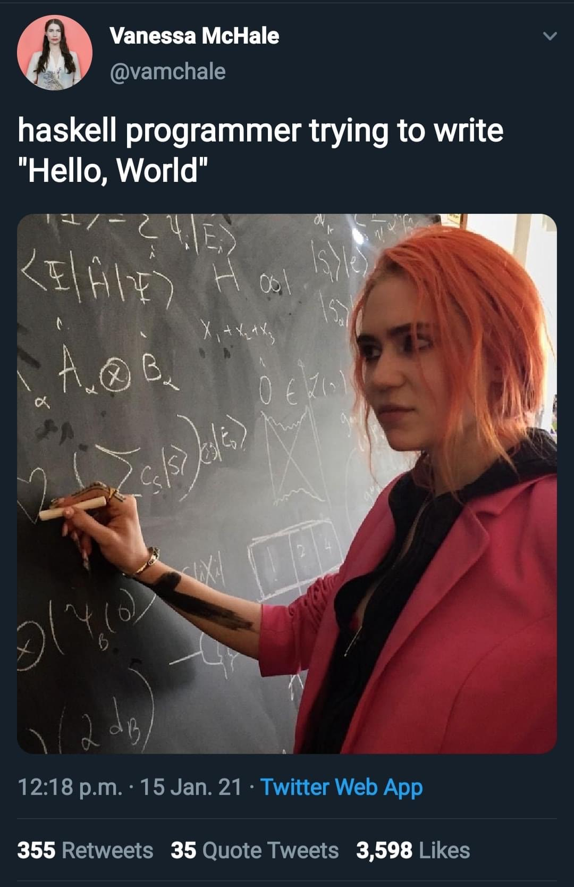

# HELLO, FRENZ!

## Rust pop-quiz answer to reading a REST endpoint: 

[code](https://github.com/logicalgraphs/crypto-n-rust/blob/pivot-quiz-01-answer/src/pivot/quizzes/quiz01/answer01.rs)

You see --^ that 90% of my solution is using library functions to replace code 
I've already written, ... so I feel like a #Haskell programmer. Eheh. 😅

