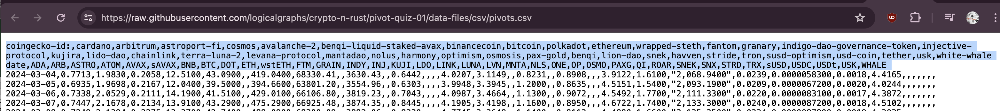
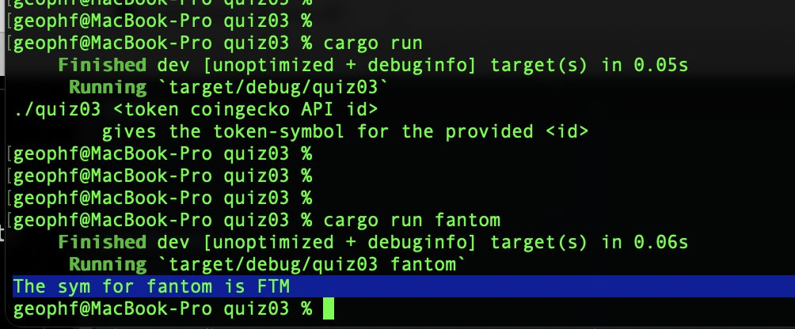

# Pivot pop-quiz 03

You see, when you complete the previous quizfos that the first two lines of 
quotes.csv are metadata:

* line 1: @coingecko token API ids
* line 2: token-symbols

Pair line 1 to line 2, then query a token API id to get its corresponding 
symbol, thusly:

* [answer](answer.md)
