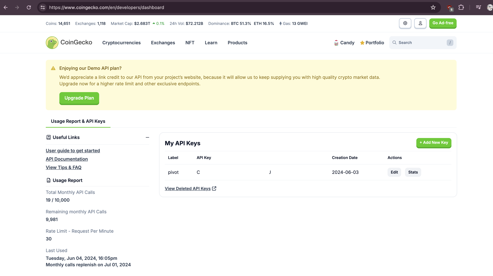
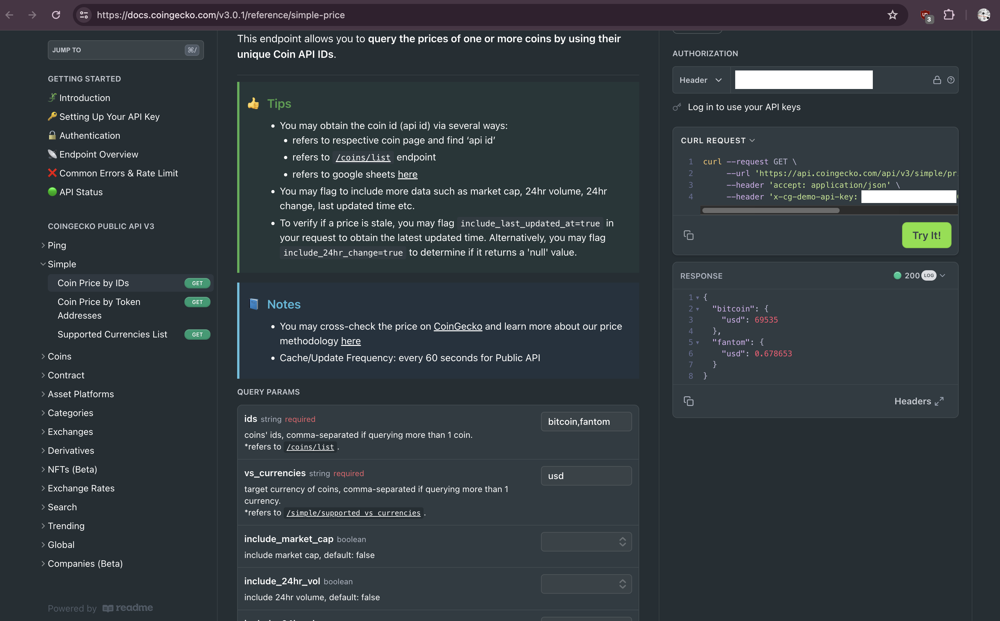

# Pivot pop-quiz 04:

## Coingecko API-Key

Go to @coingecko.

Sign up as a developer and obtain an API-key (free-tier) 
[here](https://www.coingecko.com/en/developers/dashboard)

You'll need this API-key to query their REST endpoint to get price-quotes for 
various and sundry cryptocurrency. 

That's it. That's this quiz.

## Coingecko sandbox

Follow-up, as you can do more than just sign up as a dev on @coingecko and get 
an API-key. Once you get that key, go to their sand-box, and key in a couple of 
IDs and get the current price-quotes for those tokens.

I used, e.g.: bitcoin,fantom

[sandbox](https://docs.coingecko.com/v3.0.1/reference/simple-price)

