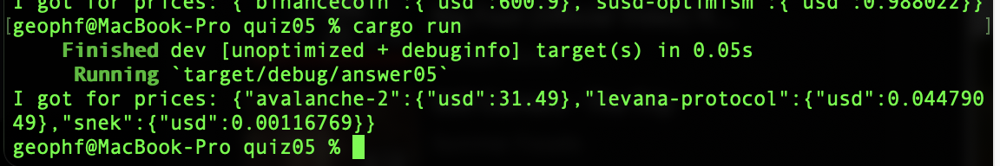

# Pivot quiz 05 answer

## Reading prices from coingecko

Because coingecko requires you pass your authorization token in the https
header, relying on a simple GET request doesn't cut it for this solution,
so I had to go back and update my `reqwest`-library to 0.12.4 and switch to 
their (standard, yes) asynchronous-approach.

So now I have a lot of `await`s littered throughout my code, which I'll 
probably need to clean up when I get my head around when to synchronize and
when to pass around `Future`-values.

That said, I leaned on the previous work, but there are some surprises in
store with this solution.

The answer is 'simple' enough: ([answer05.rs](answer05.rs)), but, as directed,
the prior functionality (of creating a coingecko token-id dictionary) was rolled
up into the swerve library module, [token_ids.rs](../../swerve/token_ids.rs).

Now, the call to coingecko to get token-prices _could have been_ complicated,
but, fortunately, the `reqwest`-library encapsulated all those difficulties
into its builder, including adding headers and adding parameters and values
to the query-string, so, that was sweet! 
[fetch_prices.rs](../../swerve/fetch_prices.rs)

The result (and the complications, for me) is as follows:



```JSON
{
   "avalanche-2":{"usd":31.49},
   "levana-protocol":{"usd":0.04479049},
   "snek":{"usd":0.00116769}
}
```

I hate this particular style of JSON, that is:

```JSON
{ "(token id)": "(value)" }
```

What do I hate about this? Well, let me present the alternative:

```JSON
{
   "token-id": "avalanche-2",
   "quote": {
      "currency": "usd",
      "value": 31.49
   }
}
```

Do you see the difference? *THE KEYS ARE STATIC!* which makes *PARSING THE
JSON INTO UNIFORMLY-TYPED VALUES* façile!

But I don't have the latter. I have the former.

The next exercise will be ... _'fun.'_

## Rant

I eff'n HATE drooling idiots who (don't) create schemata for uniform 
data-as-JSON from API endpoints.

```JSON
{ "avalanche-2": { "usd": 31.49 },
   "bitcoin": { "usd":...
```

Anybody see the problem with this?

Why not:

```JSON
{ "token-id": "avalanche-2",
  "quote": { "currency": "usd",...
```

HUH?

When you, the consumer, try to consume the above JSON (the one with _VARIANT 
KEYS?!?!?_) in a programatic-fashion?

You're going to have to hack the HELL around trying to define what a key is, 
_BECAUSE THE KEY IS A VALUE, FFS!_

Perverting JSON's _VERY CLEAR_ structure is just stupid!

Maybe it's because I have a 25-year background in structured data and 
knowledge-engineering, but when you define your schema as:

> "The key is the name of the token id"

instead of

> "The key is 'token-id' because it's an eff'n _KEY_ not an eff'n _VALUE!"_

Then you're an eff'n idiot.

Remember, kids, there's a difference between:

* metadata, or labels 

verses

* data, or values.

If you call yourself a computer scientist, software engineer, or data 
scientist, you should know this.

And if you don't know this, stop calling yourself what you're not.

My 2¢.

## Postlude

Now, for my next rant:

Let's talk about people who put compound or composite values into (atomic) 
cells, so you have to _CREATE A PARSER_ to ingest data _FROM A DATABASE?!???_ 
... when they could have just as easily loaded each atomic value into its 
own (labeled/typed) cell?

Fun!
