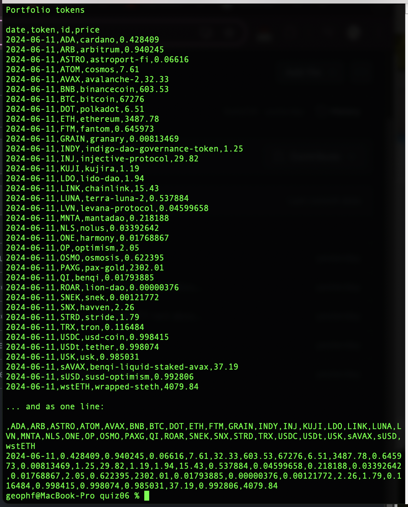

# Pivot quiz 06 answer

## Fetching token-prices from coingecko REST endpoint, programmatically

HA!

HAHA! MWA-HAHAHAHAHAHA!

Fetching my portfolio prices from @coingecko using their /simple/price REST 
endpoint, programmatically.

_HA!_ 😈

The 'E' of the Pivot ETL is now sufficient to create an autonomous app that
refreshes the pivot database on a daily cadence.

## Analyses

There's quite a bit going on here.

* loading of pivots and prices under one roof,
[snarf.rs](../../swerve/snarf.rs)
* all (public) types collected into
[types.rs](../../swerve/types.rs) so the JSON-parsing, reductive though it be,
falls out naturally here.
* [reports.rs](../../swerve/reports.rs) provides both portfolio report and the
daily update to
[quotes.csv](../../../data-files/csv/quotes.csv)
* There's a clever bit of sorting by token-symbol root in
[fetch_prices.rs](../../swerve/fetch_prices.rs)
* There's an unclever sledgehammer disregard for arrows from Category Theory
there, was well (8 lines up)
