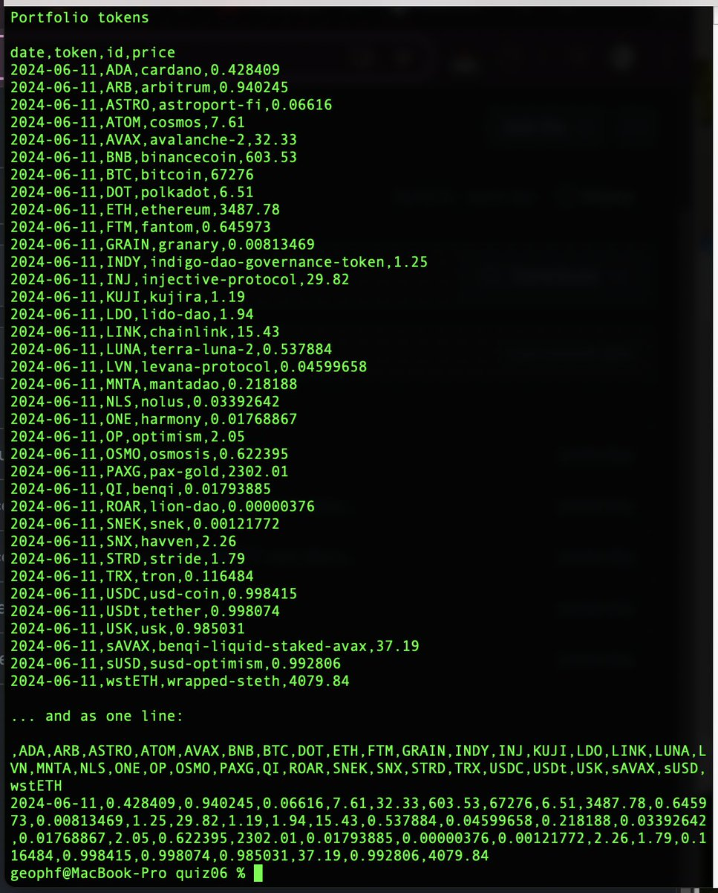

# Pivot quiz 07

## Automated Response Verification then follow-on workflow

Okay, we're getting back token-prices from @coingecko and reporting them. YAY!

How do we know what we get back is kosher? That is: are all the tokens we 
requested in the response?

1. Write a verifier that reports: "Good" or "Missing: $BTC, ..."

2.a.

(1) IF the response is GOOD, update $CVS_DIR/pivots.csv 'database' with the 
new row of data.

(2) SIMULATE calling trade-analytics on pivots-data.

2.b. (or not 2.b. lulz)

IF the response is BAD,
SIMULATE emailing, slacking, telegramming the devs to FIX THE APP THEN MAKE 
TOKEN-PRICES GO UP! 😤

Because when token-prices go down, who's to blame? THOSE PESKY DEVS, ofc! 😤

um, ... jk? 😅😭

* ([answer](answer.md))
