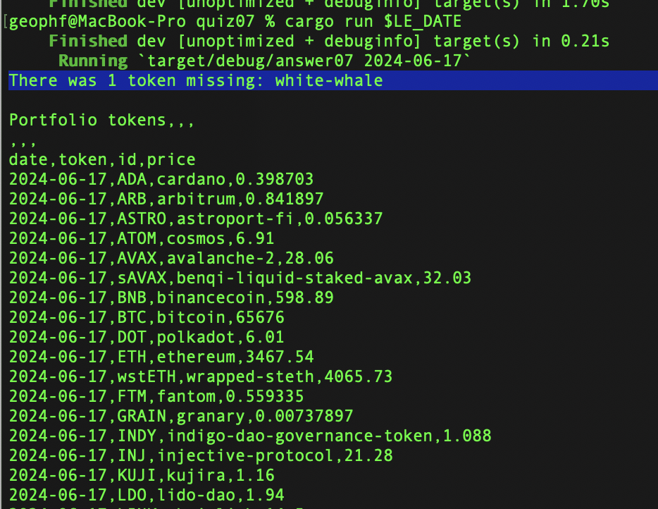

# Pivot quiz 07 answer

## verifying we got the token-prices we asked for from coingecko

So, this was a bit of an interesting problem. I have known, for some time,
that WhiteWhale's $WHALE prices weren't coming back, and I suspected that issue
was due to $WHALE being the last token on the list of tokens in
[quotes.csv](../../../../data-files/csv/quotes.csv).

Come to find: I was correct!

Simply adding `String::trim_end` to a composed-map-function in
[snarf.rs](../../swerve/snarf.rs#L25) did the trick, but there was quite the
journey to be able to effect this correction.

What-all changed in this iteration?

## Changes

1. I broke [`fetch_prices`](../../swerve/fetch_prices.rs#L35) into two 
functions: `fetch_prices` and `transform_prices`. Why? Because I found in the
midst of the old `fetch_prices` that I needed to do my verification-check of
token-prices returned. Control-flow mid-function, particularly should the need
for an escape arise, becomes tricky if this workflow were to remain one 
function only.
2. I added `report_diffs` that only fires if there are `Diffs`, so `Diffs` is
returned as `Option<Diffs>` (again: control-flow).
3. [snarf.rs](../../swerve/snarf.rs#L40) now manages diffs in the workflow.
4. [types.rs](../../swerve/types.rs) has two new types: `RawPrices` and `Diffs`
to manage diff-discovery _in media proces_.
5. And now there's a new [verification module](../../swerve/verify.rs).
