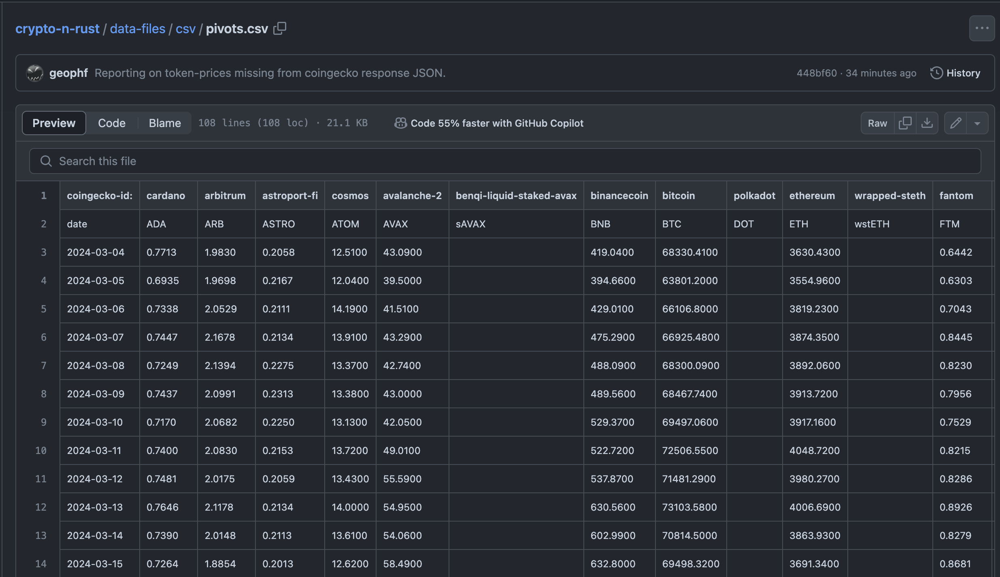

# Pivot quiz 08

## Pivot database

Now that we are capturing token-prices from @coingecko, we need to start 
analyzing it. You see that I repose these data into 
[pivots.csv](https://raw.githubusercontent.com/logicalgraphs/crypto-n-rust/main/data-files/csv/pivots.csv).

So! Ingest this spreadsheet, then:

1. What is the date-range of data?
2. Output the most recent prices.
