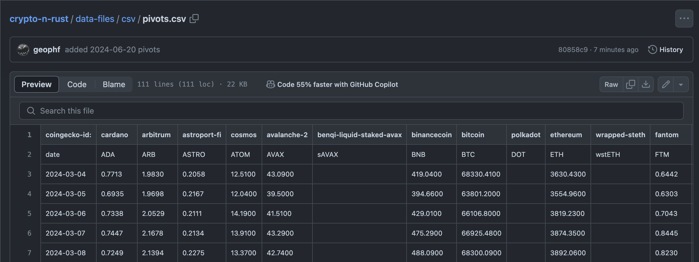

# Pivot quiz 09

## Separate concerns: gecko reports 1-row of quotes from coingecko, only

We've separated portfolio-reportage from @coingecko pivot-token-fetch.

Why?

Separating concerns simplifies BUIDLn via the component-based approach.

Now:

1. exise portfolio-reporting from 
[`./gecko`](https://github.com/logicalgraphs/crypto-n-rust/tree/main/src/pivot/gecko)
and
2. concat the one row to 
[`quotes.csv`](https://github.com/logicalgraphs/crypto-n-rust/blob/main/data-files/csv/quotes.csv).

* ([answer](answer.md)]
