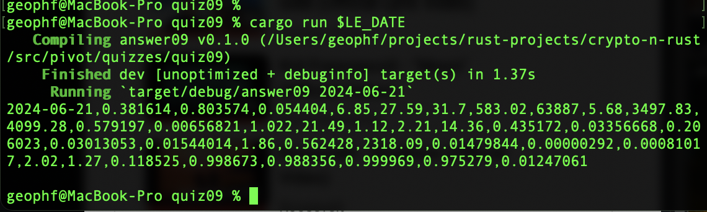

# Pivot quiz 09 answer

## "New gecko"

Separating out printing the one pivot row turned out to be a challenge of
refactoring [reports.rs](../../swerve/reports.rs) appropriately.

Then reporting on completed-status, or errors, was a fun little control-flow
exercise in [the answer](answer09.rs).
