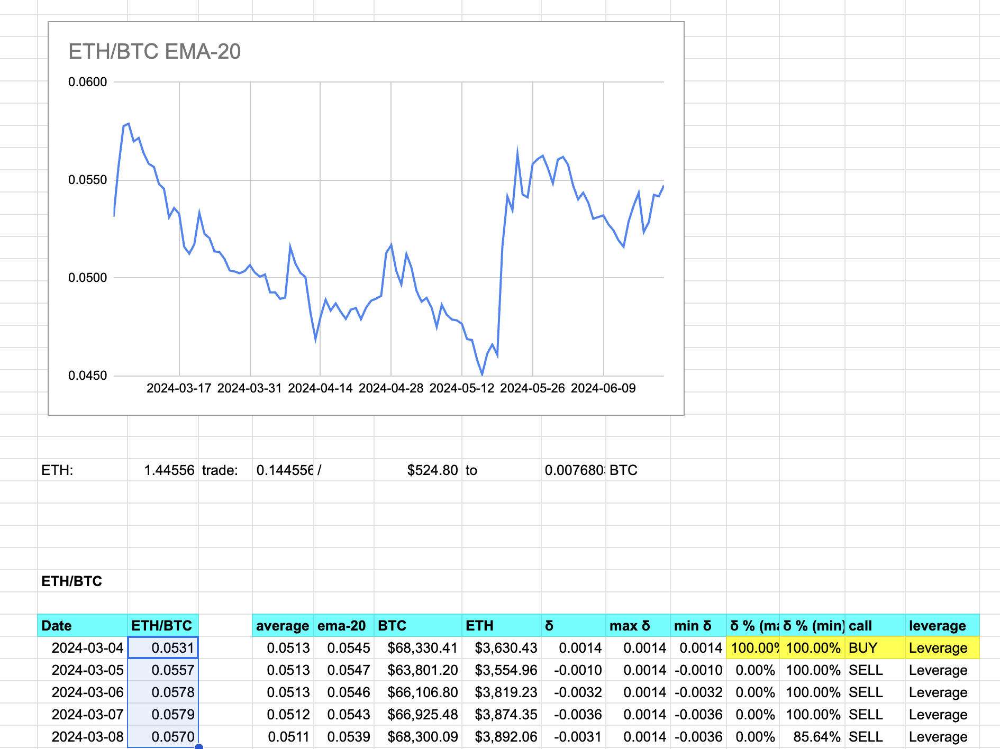

# Pivot quiz 10

## Computing two-token ratios

Thus, we begin our data analytics (or setting up for it, at any rate).

Given two tokens, say, $ETH and $BTC, compute their ratios over time.

Of course, use [pivot.csv](../../../../data-files/csv/pivots.csv) as your
database.

... which means you need to read those data, extract the appropriate two sets,
then compute the ratios back into the time-series.

* [(answer(answer.md))]
