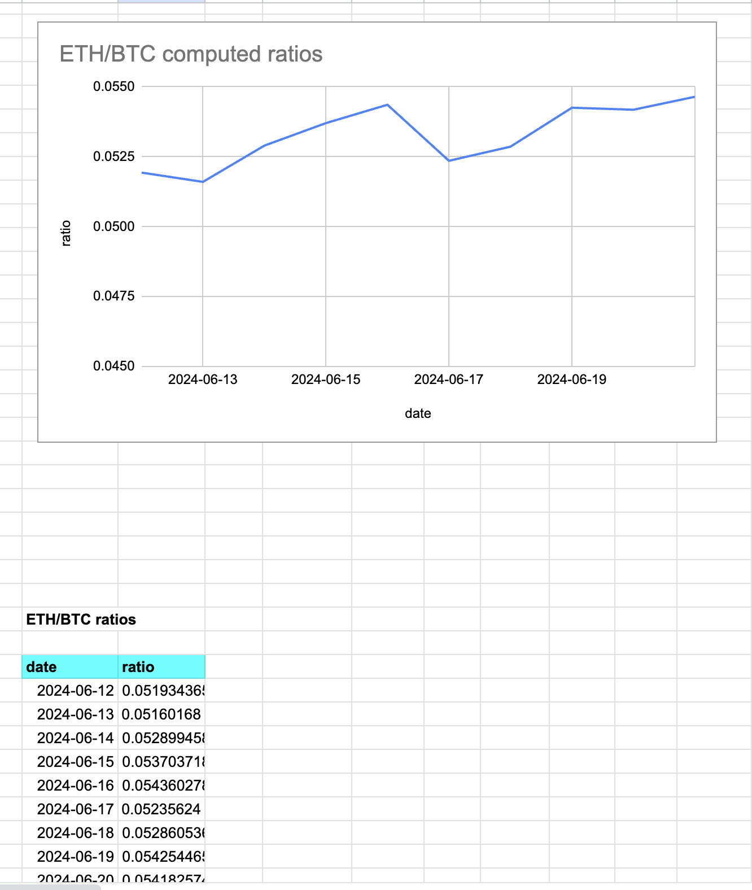
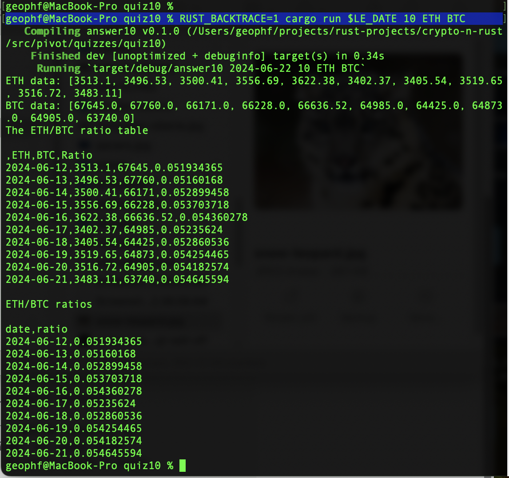
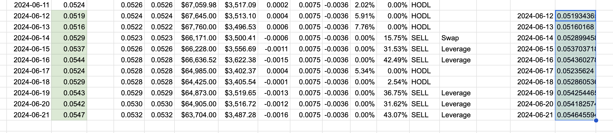

# Pivot quiz 10 answer

## Computing token-pair ratios

Most of the work of this exercise was handled by 
[`table_utils.rs`](../../../libs/book/table_utils.rs). The solution,
[`answer10.rs`](answer10.rs), ingests the table, filters down to the last
`n` days of data (I selected 10 days for this example), then selects two
tokens to compare (I picked $ETH and $BTC here).

Just to be sure I was doing everything correctly, I hand-compared the results
from the program run-off to the ratios computed in my SPREADSHEETSZORxEN!

You'll be happy to hear that the two data-sets gave similar results.
