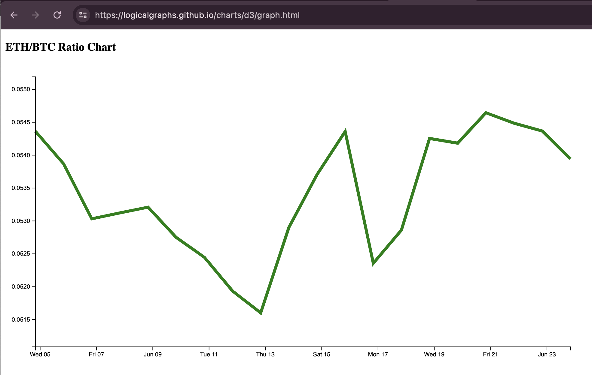

# Pivot quiz 11 answer

## serializing ratios as JSON

The majority of the work was (re-)activating the 
[json_utils](../../../libs/book/json_utils.rs) so that serialization of Rust
structures become, _not JSON_, but JavaScript objects.

> (There is a distinction.)

We then embed these data directly into whichever chart-renderer you choose.

An example of such is the 
[d3js.org line-chart](https://logicalgraphs.github.io/charts/d3/graph.html) 
I have on my page (you can view the sources):

