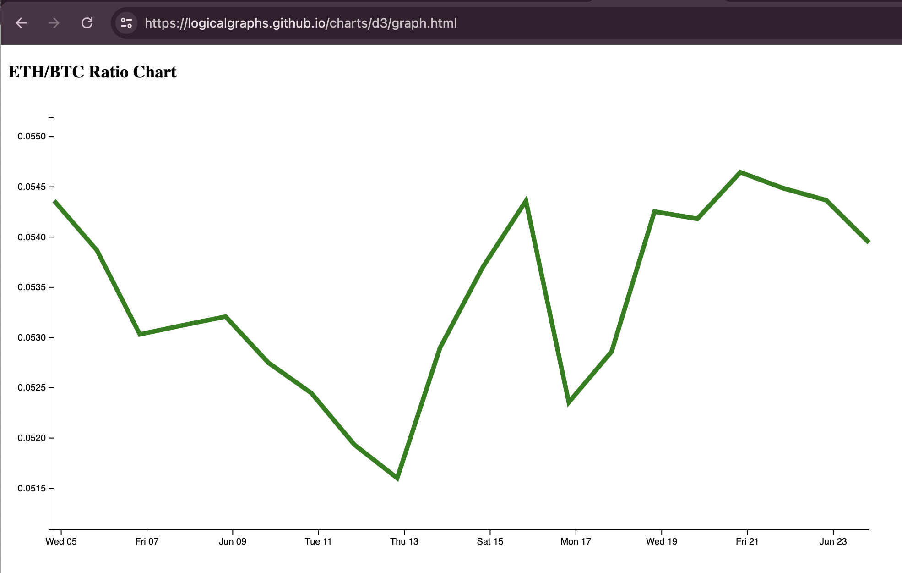

# Pivot quiz 12

## Compute and chart EMA20

Now that I have ratios (e.g.: ETH/BTC, show, but it could be any token-set), 
first compute, then chart, the 
[EMA](https://www.investopedia.com/terms/e/ema.asp)20, overlaying the ratio.

* ([answer](answer.md))
