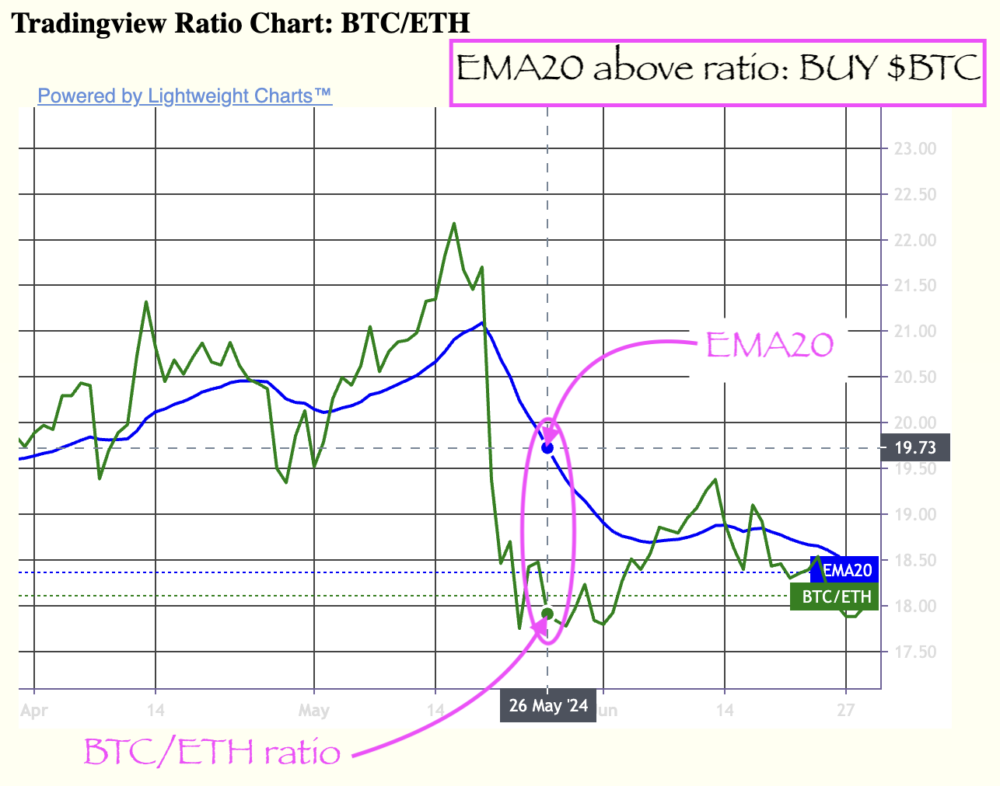
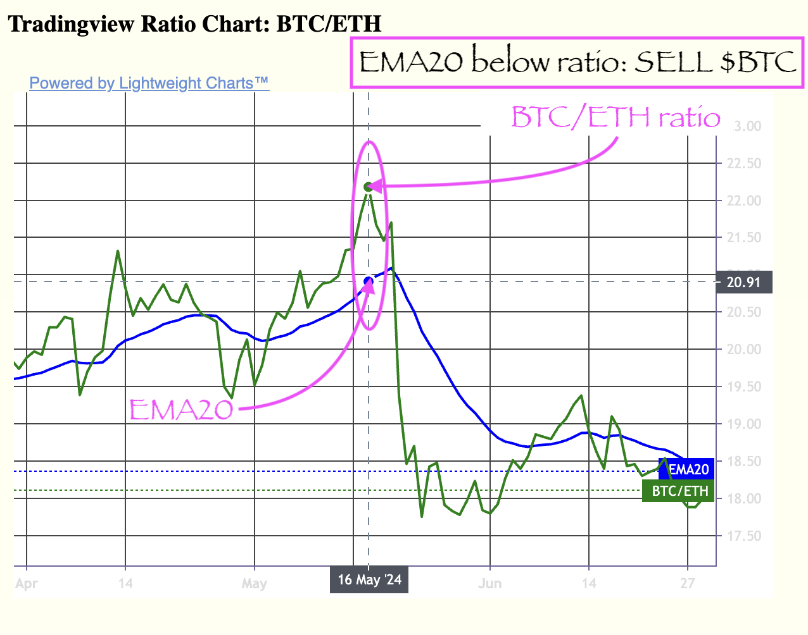

# Pivot quiz 13: get rekt!

Given that we can automatically compute the EMA20s for any token-pair in
[pivots.csv](../../../../../data-files/csv/pivots.csv), use that information
to make a buy- or sell-call for that token-pair.

I have a write-up on pivoting on EMA20s
[here](../../rekt).

* ([answer](answer.md))
