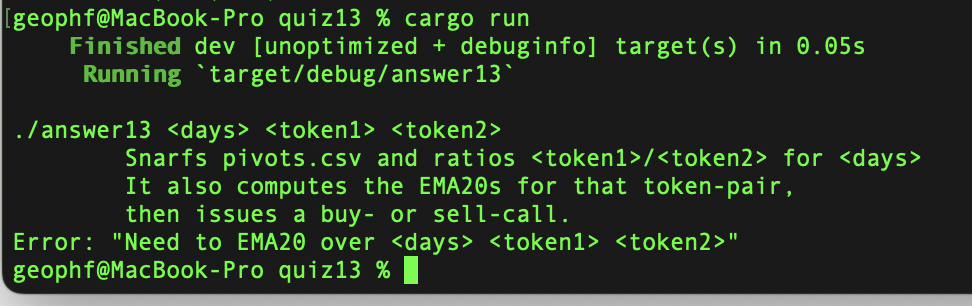
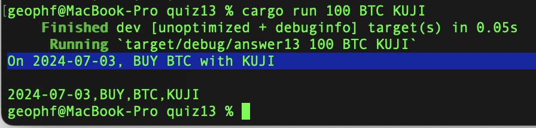
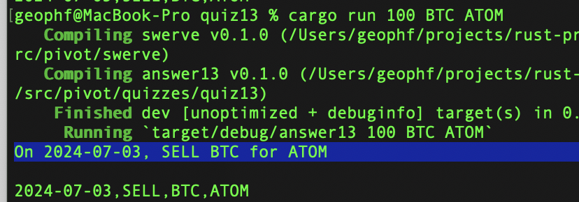

# Pivot quiz 13 answer

## Recommend buy- or sell- of target token based upon EMA20-vs-ratio

This solution took (much) longer than anticipated, because I switched from a
panic!-when-parse-failure-approach to the standard parsing approach: `Result`.

In so doing, come to find, `filter_map` didn't play well with `Result`-types
for me, so I had to unwind the functional-`map` parsing of the table to a
`for`-loop.

I also had to separate types, both in my `book`-library (particularly for
`Stamped`-values) and for my pivot-library: `Rec` is not a procedure, it's a
type. This allows me to save it out as CSV and, eventually add δs. Now, `Rec`
only works because I created a new type, `Name`, which separates `target` and
`base`-tokens.

The bulk of the work was to move the ensnarfation from `main()` to 
[snarf.rs](https://github.com/logicalgraphs/crypto-n-rust/blob/pivot-quiz-13-answer/src/pivot/swerve/snarf.rs#L45-L79)
